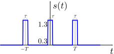
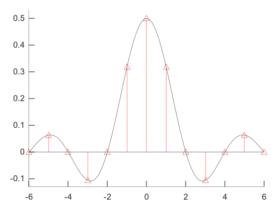
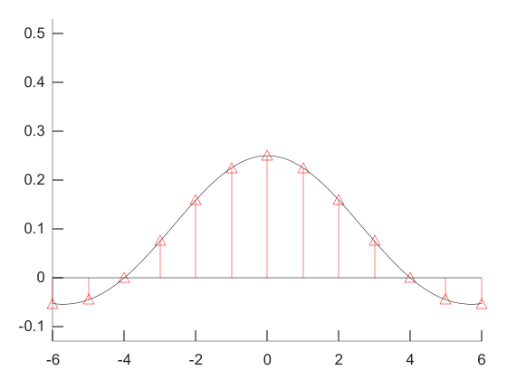

#

## 1번

$$
\begin{equation}
\begin{split}
\int_{-\infty}^{\infty}f_X(x)dx&=1\\
\Rightarrow \int_{-\infty}^{\infty}Ce^{-2|x|}dx&=2C\int_0^{\infty} e^{-2x}dx\\
&=-C\left[e^{-2x}\right]_0^\infty\\
&=Ce\\
\therefore C=1
\end{split}
\end{equation}
$$

이므로 답은 **4번** 이다.

## 2번

$t=1$ 지점에서 $f(t)$가 옮겨져서 시작되지만 한 주기 다음인 $t=3$에서 $-f(t)$가 옮겨져서 시작되므로 여기서부터는 상쇄된다.
이와 같이 $t=5$에서 $f(t)$가 옮겨져서 시작되지만 $t=7$에서 $-f(t)$가 옮겨져서 시작되므로 여기서부터 다시 상쇄된다. 마지막으로 $t=9$에서 $f(t)$가 옮겨져서 시작된다.
따라서 답은 **2번** 이다.

## 3번

위 신호를 푸리에 변환해보자. 시간 축에서 이동하더라도 위상 변화만 있을 뿐이니 편의성을 위해서 위와 같이 놓았다. 우선 신호를 푸리에 급수로 표현한다.

$$
x(t)=\sum_{k=-\infty}^{\infty}C_ke^{j\frac{2\pi}{T}kt}
$$

이 식에서 $C_k$를 구해보자.

$$
\begin{equation}
\begin{split}
C_k&=\frac{1}{T}\int_{-\frac{T}{2}} ^\frac{T}{2} x(t)e^{-j\frac{2\pi}{T}kT}dt\\
&=\frac{1}{T}\int _{-\frac{\tau}{2}} ^\frac{\tau}{2} 1\cdot e^{-j\frac{2\pi}{T}kt}dt\\
&=\frac{1}{T}\cdot\frac{1}{-j\frac{2\pi}{T}k}\left(e^{-j\frac{2\pi}{T}k\cdot\frac{\tau}{2}}-e^{j\frac{2\pi}{T}k\cdot\frac{\tau}{2}}\right)\\
&=\frac{1}{T}\cdot\frac{T}{\pi k}\cdot\frac{1}{j2}\left(e^{j\frac{\pi}{T}k\tau}-e^{-j\frac{\pi}{T}k\tau}\right)\\
&=\frac{1}{\pi k}sin\left(\frac{\pi}{T}k\tau \right)
\end{split}
\end{equation}
$$

따라서

$$
x(t)=\sum_{k=-\infty}^{\infty}\frac{1}{\pi k}sin\left(\frac{\pi}{T}k\tau \right)e^{j\frac{2\pi}{T}kt}
$$

이다.

이를 푸리에 변환하면

$$
\begin{equation}
\begin{split}
X(f)&=\int_{-\infty}^\infty \sum_{k=-\infty}^{\infty}\frac{1}{\pi k}sin\left(\frac{\pi}{T}k\tau \right)e^{j\frac{2\pi}{T}kt} e^{-j2\pi ft}dt\\
&=\sum_{k=-\infty}^{\infty}\frac{1}{\pi k}sin\left(\frac{\pi}{T}k\tau \right) \int_{-\infty}^{\infty}e^{j\frac{2\pi}{T}kt} e^{-j2\pi ft}dt\\
&=\sum_{k=-\infty}^{\infty}\frac{1}{\pi k}sin\left(\frac{\pi}{T}k\tau \right) \int_{-\infty}^{\infty} e^{-j2\pi\left(f-\frac{k}{T} \right)t}dt\\
&=\sum_{k=-\infty}^{\infty}\frac{1}{\pi k}sin\left(\frac{\pi}{T}k\tau \right) \delta\left(f-\frac{k}{T}\right)
\end{split}
\end{equation}
$$

1. $\tau=\frac{T}{2}$인 경우를 그려보면 다음과 같다.
   
   따라서 주엽에 포함된 크기가 0이 아닌 선 스펙트럼의 수는 3개이다.
2. $\tau=\frac{T}{4}$인 경우를 그려보면 다음과 같다.
   
   간격은 같아 보이는데, 실제로도 그렇다. 왜나면 위 식에서 간격은 델타 함수 안의 $\frac{k}{T}$에 의존하는데 $T$는 두 경우에서 같기 때문이다.
3. 위 그림들에서 주엽의 폭은 동일하지 않다. 수식적으로는 주엽의 폭은 $sin\left(\frac{\pi}{T}k\tau\right)$에 의존하는데, 여기서 $\tau$가 다르기 때문이다.
4. 최대 선 스펙트럼의 크기는 $k=0$일 때 나타나는데, 이 때의 값은 $\frac{\tau}{T}$이다.(왜일까?) 따라서 $x(t)$의 최대 선 스펙트럼의 크기는 $y(t)$보다 크다.

따라서 답은 **3번** 이다.

## 4번

계산할 필요도 없이 답은 **1번** 이다. 평균 정보량이 가장 크다는 것은 불확실한 정도가 가장 크다는 것이다. 그러려면 확률이 어때야 하는가? 치우침 없이 고르게 퍼져 있어야 한다. 한 쪽으로 치우치면 다른 쪽보다 발생할 확률이 높아지니 불확실한 정도가 낮아진다.

## 5번

채널 용량은

$$
C=Wlog_2(1+SNR)
$$

이다. SNR이 크다면 위 식은 $C\approx Wlog_2(SNR)$로 근사된다.
따라서 신호 전력이 두 배로 증가하면 채널 용량은

$$
\begin{equation}
\begin{split}
C_2&=Wlog_2(2SNR)\\
&=Wlog_2 2+Wlog_2(SNR)\\
&=W+Wlog_2(SNR)\\
&=W+C\\
\Rightarrow \frac{C_2}{C}&=\frac{W}{C}+1\\
&=0.1+1
\end{split}
\end{equation}
$$

이다. 그러므로 0.1, 즉 10% 증가하므로 답은 **2번** 이다.

## 6번

1. ㄱ: 에르고딕 프로세스는 시간 평균과 앙상블 평균이 같다.
2. ㄴ: 그렇다. WSS의 정의이다.
3. ㄷ: 그렇지 않다. 정상 프로세스라는 조건에서 시평균과 앙상블 평균이 같아야만 할 이유가 없다.
4. ㄹ: 그렇지 않다. 설명은 좁은 의미의 정상 프로세스(SSS)에 대한 것이다. SSS이면 WSS이지만 그 역은 성립하지 않는다. 확률분포가 달라도 평균은 일정할 수 있다.

따라서 답은 **1번** 이다.

## 7번

음성신호는 실함수이다. 따라서 변환한 결과를 $X(f)$라고 하면

1.  $$
    \begin{equation}
    \begin{split}
    X(f)&=\int_{-\infty}^{\infty}x(t)e^{-j2\pi ft}dt\\
    &=\int_{-\infty}^{\infty}x(t)(cos(2\pi ft)-jsin(2\pi ft))dt\\
    &=\int_{-\infty}^{\infty}x(t)cos(2\pi ft)dt-j\int_{-\infty}^{\infty}x(t)sin(2\pi ft)dt\\
    \Rightarrow |X(f)|^2&=\left(\int_{-\infty}^{\infty}x(t)cos(2\pi ft)dt \right)^2+\left( -j\int_{-\infty}^{\infty}x(t)sin(2\pi ft)dt \right)^2\\
    &=\left(\int_{-\infty}^{\infty}x(t)cos(2\pi ft)dt \right)^2+\left(\int_{-\infty}^{\infty}x(t)sin(2\pi ft)dt \right)^2\\
    X(-f)&=\int_{-\infty}^{\infty}x(t)e^{j2\pi ft}dt\\
    &=\int_{-\infty}^{\infty}x(t)(cos(2\pi ft)+jsin(2\pi ft))dt\\
    &=\int_{-\infty}^{\infty}x(t)cos(2\pi ft)dt+j\int_{-\infty}^{\infty}x(t)sin(2\pi ft)dt\\
    \Rightarrow |X(-f)|^2&=\left(\int_{-\infty}^{\infty}x(t)cos(2\pi ft)dt \right)^2+\left( j\int_{-\infty}^{\infty}x(t)sin(2\pi ft)dt \right)^2\\
    &=\left(\int_{-\infty}^{\infty}x(t)cos(2\pi ft)dt \right)^2+\left(\int_{-\infty}^{\infty}x(t)sin(2\pi ft)dt \right)^2\\
    &=|X(f)|^2\\
    \therefore |X(f)|&=|X(-f)|
    \end{split}
    \end{equation}
    $$
    이므로 크기는 주파수에 대해 우함수이다.
2.  위상에 대해 계산해보면
    $$
    \begin{equation}
    \begin{split}
    \angle{X(f)}&=arctan\left( \frac{-\int_{-\infty}^{\infty}x(t)sin(2\pi ft)dt}{\int_{-\infty}^{\infty}x(t)cos(2\pi ft)dt} \right)\\
    &=-arctan\left( \frac{\int_{-\infty}^{\infty}x(t)sin(2\pi ft)dt}{\int_{-\infty}^{\infty}x(t)cos(2\pi ft)dt} \right)\\
    \angle{X(-f)}&=arctan\left( \frac{\int_{-\infty}^{\infty}x(t)sin(2\pi ft)dt}{\int_{-\infty}^{\infty}x(t)cos(2\pi ft)dt} \right)\\
    &=-\angle{X(f)}
    \end{split}
    \end{equation}
    $$
    이므로 주파수에 대해 기함수이다.
3.  그렇다.
4.  그렇다. 제곱해서 적분하면 된다.

따라서 답은 **1번** 이다.

## 8번

1. 메시지가 4비트이고 패리티가 3비트이므로 (7,4) 부호이다.
2. 그렇다. 해밍 거리가 3이기 때문에 이의 절반인 1.5비트를 반지름으로 갖는 수신 심볼 구 내에 찍히는 점은 가장 가까운 심볼이 원래 심볼이라고 추정이 가능하기 때문이다.
3. 그렇다. $p_1=m_1+m_2+m_4$이므로 행렬의 패리티 부분은 세로로 1,2,4번째 자리에 1이 온다. 마찬가지 방식으로 $p_2$, $p_3$에 대해 행렬의 패리티 부분을 완성할 수 있다.
4. $$
   \begin{equation}
   \begin{split}
   Gx^T&=\begin{bmatrix}
   1&0&0&0&1&1&1\\
   0&1&0&0&1&0&1\\
   0&0&1&0&0&1&1\\
   0&0&0&1&1&1&0
   \end{bmatrix}
   \begin{bmatrix}
   1\\0\\1\\1\\0\\0\\0
   \end{bmatrix}\\
   &=\begin{bmatrix}
   1\\
   0\\
   1\\
   1
   \end{bmatrix}\neq \begin{bmatrix}
   0\\
   0\\
   0\\
   0
   \end{bmatrix}
   \end{split}
   \end{equation}
   $$
   이므로 유효한 부호어가 아니다.

따라서 답은 **4번** 이다.

## 9번

먼저 반송파 주파수 200 kHz가 1000배 되었으므로 $y(t)$의 반송파 주파수는 200 MHz이다.
한편 주파수 편이비는 신호의 주파수 대비 주파수 편이인데, 주파수 편이가 1000배 되었으므로 주파수 편이비는

$$
\frac{20\times 1000}{10k}=2
$$

이다.
따라서 답은 **4번** 이다.

## 10번

1. 명확하게 조건이 주어지지는 않았으나 반송파 주파수는 메시지 주파수의 대역폭보다 훨씬 크다. 따라서 DSB 변조를 하게 되면 기저대역의 메시지 주파수의 음의 영역에 있던 성분도 양의 영역인 반송파 주파수의 왼쪽으로 옮겨지므로 대역폭은 2배가 된다.
   그러므로 메시지 주파수의 대역폭이 4 kHz이면 DSB 신호의 대역폭은 8 kHz이다.
2. 그렇다. 반송파가 더해지지 않기 때문이다.
3. 포락선 검파를 하려면 반송파 주파수가 필요하다.
4. 그렇다. 곱해서 LPF를 통과시키면 된다.

따라서 답은 **3번** 이다.

## 11번

채널코딩이 성능이 무조건 좋은 것은 아니다. 채널코딩을 하면 잉여 비트에도 에너지가 할당되므로 비트당 에너지는 낮아지게 되는데, 그렇게 되면 에러 확률이 올라간다. 채널코딩으로 감당할 수 있는 것보다 에러가 많이 발생하게 되면 채널코딩을 하느니만 못하게 되어버린다.
한편 길쌈부호는 길쌈 연산처럼 과거 정보도 필요하다. 따라서 답은 **3번** 이다.

## 12번

1. 그렇다.
2. 복잡한 실내 공간에서는 반사되어서 돌아오거나 회절하는 등 경로가 더 많기 때문에 ISI가 더 심각하다.
3. 저속 전송을 하는 편이 좋다. 그렇게 되면 한 심볼 구간 내에 동일한 심볼이 위상만 변화해서 들어와서 겹쳐지므로, 위상차를 안다면 오히려 신호가 보강된다. 이를 이용하는 것이 OFDM이다.
4. 그렇다.

따라서 답은 **3번** 이다.

## 13번

1. 그렇다. AM은 선형 시스템이므로 비선형 증폭을 하게 되면 진폭에 실린 정보가 일그러진다. 하지만 FM은 리미터를 사용해서 일그러짐을 잘라내고 주파수 성분만 꺼내면 된다.
2. 그렇다.
3. 그렇다. 일부 대역이 혼신되더라도 훨씬 더 넓은 영역에 정보를 싣기 때문에 손상되는 비율이 적다. 하지만 AM은 사용하는 대역에 혼신이 들어오게 되면 손상되는 비율이 크다.
4. 그렇지 않다.

따라서 답은 **4번** 이다.

## 14번

위상편이는 반송파 주파수 대비 위상 차이이므로 $10^t^2$이다.
주파수 편이는 위상 편이를 미분한 것을 $2\pi$로 나눈 값이므로 $\frac{10}{\pi}t$이다. 그러므로 답은 **3번** 이다.
