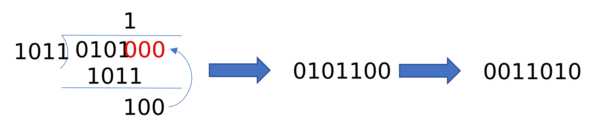

#

## 1번
FM신호를 복조했을 때의 SNR은
$$
SNR_{FM,O}=\frac{3A^2k^2_fP}{2N_0W^3}
$$
이다.
1. 변조 지수 $\beta$가 클수록 더 넓은 대역폭 $W$를 쓰므로 성능이 좋아진다.
2. 메시지 신호의 진폭 $A$가 클수록 변조가 많이 되므로 성능이 좋아진다.
3. 초기 위상은 SNR 계산에서 아무 역할도 하지 않는다.
4. 메시지 신호의 주파수가 클수록 대역폭 $W$을 많이 쓰므로 SNR이 좋아진다.

그러므로 **3번**이 답이다.

## 2번
전체 확률이 $1$이어야 한다. 따라서
$$
\begin{equation}
\begin{split}
\int_{-\infty}^{\infty}f_X(x)dx&=\int_{-1}^{1}c(1-x^2)dx\\
&=2c-2c\cdot \frac{1}{3}\\
&=1
\end{split}
\end{equation}
$$
이므로
$$
c=\frac{3}{4}
$$
이고 답은 **1번**이다.

## 3번
엔트로피의 최댓값은 가장 불확실할 때, 즉 확률의 치우침이 없이 모두 같을 때이다.
이 때는 확률이 모두 $\frac{1}{4}$일 때이므로, 엔트로피를 구하면
$$
H=-log_2\left(\frac{1}{4}\right)=2
$$
이므로 답은 **3번**이다.

## 4번
주어진 신호를 오일러 공식을 사용하여 전개하면
$$
\begin{equation}
\begin{split}
4\cdot \frac{1}{2j}\left(e^{j\omega_0 t}-e^{-j \omega_0 t}\right)+8\cdot\frac{1}{2}\left(e^{j\omega_0 t}+e^{-j\omega_0 t}\right)&=-2je^{j\omega_0t}+2je^{-j\omega_0t}+4e^{j\omega_0t}+4e^{-j\omega_0t}\\
&=(4-j2)e^{j\omega_0t}+(4+j2)e^{-j\omega_0t}
\end{split}
\end{equation}
$$
이므로 답은 2번이다.

## 5번
$$
\begin{gather}
s_1(t)=cos(2\pi(f_0+f_1)t)\\
s_2(t)=cos(2\pi(f_0+f_2)t+\phi)
\end{gather}
$$
라 하자.
둘이 직교하려면
$$
\int_0^{T_s}cos(2\pi(f_0+f_1)t)cos(2\pi(f_0+f_2)t+\phi)dt=\int_0^{T_s}\frac{1}{2}(cos(2\pi(f_0+f_1+f_0+f_2)t+\phi)+cos(2\pi(f_0+f_1-f_0-f_1)t-\phi))dt
$$
이다.
$f_1-f_2$와 관련된 항은 두 번째 항이므로
$$
\begin{equation}
\begin{split}
\int_0^{T_s}cos(2\pi(f_0+f_1-f_0-f_2)t-\phi)dt&=\int_0^{T_s}cos(2\pi(f_1-f_2)t-\phi)dt\\
&=\left.sin(2\pi(f_1-f_2)t-\phi)\right|_0^{T_s}\\
&=sin(2\pi(f_1-f_2)T_s-\phi)-sin(-\phi)\\
&=0
\end{split}
\end{equation}
$$
이어야 한다.
그러므로
$$
\begin{gather}
sin(2\pi(f_1-f_2)T_s-\phi)=-sin(\phi)\\
\Rightarrow sin(2\pi(f_1-f_2)T_s)cos(\phi)-cos(2\pi(f_1-f_2)T_s)sin(\phi)=-sin(\phi)\\
\Rightarrow cos(2\pi(f_1-f_2)T_s)=1
\end{gather}
$$
및
$$
sin(2\pi(f_1-f_2)T_s)=0
$$
일 때 최소이므로
$$
2\pi(f_1-f_2)T_s=2m\pi
$$
어야 한다. 따라서
$$
f_1-f_2=\frac{1}{T_s}
$$
일 때 최소이므로 답은 **3번**이다.

## 6번
1.  
  $$
  \begin{equation}
  \begin{split}
  Cov[X,Y]&=E[(X-\overline{X})(Y-\overline{Y})]\\
  &=E[XY-\overline{X}Y-X\overline{Y}+\overline{X}\cdot\overline{Y}]\\
  &=E[XY]-2\overline{X}\cdot\overline{Y}+\overline{X}\cdot \overline{Y}\\
  &=E[XY]-\overline{X}\cdot\overline{Y}
  \end{split}
  \end{equation}
  $$
  이므로 $0$이 아니다.
2. 독립이면
   $$
   E[XY]=E[X]E[Y]
   $$
   이므로
   $$
   \begin{equation}
   \begin{split}
   Cov[X,Y]&=E[XY]-E[X]E[Y]\\
   &=E[X]E[Y]-E[X]E[Y]\\
   &=0
   \end{split}
   \end{equation}
   $$
   이다.
3. $X=Y$이면
   $$
   Cov[X,Y]=E[(X-E[X])^2]=Var[X]
   $$
   이다.
4. 기댓값은 선형 연산이므로
   $$
   E[Z]=E[X+Y]=E[X]+E[Y]
   $$
   이다.

따라서 **1번**이 옳지 않다.

## 7번
1. 독립인 가우시안 랜덤변수들의 합은 가우시안 랜덤변수이다.
2. 평균이 $0$인 가우시안의 제곱의 합의 제곱근은 레일리 확률 밀도 함수를 갖는다. 평균이 $0$이 아니면 라이시안 확률 밀도 함수를 갖는다.
3. 옳다.
4. 평균은 $0$이 맞지만 분산은 $L^2$이다. 흩어진 값들을 더하니 더 흩어지는 것이다.

따라서 답은 **4번**이다.

## 8번
$$
\begin{equation}
\begin{split}
Y_k&=X_k*\frac{1}{2}(\delta_{k-1}+\delta_{k+1})\\
&=\frac{1}{2}(X_{k-1}+X_{k+1})
\end{split}
\end{equation}
$$
이므로 답은 **2번**이다.

## 9번
1. 주기 신호이므로 푸리에 변환하면 이산 스펙트럼으로 나타난다.
2. 주엽의 폭은
   $$
   \frac{1}{\tau}
   $$
   이므로 $T$와는 상관없다.
3. 옳다.
4. 코사인 함수들의 합으로 나타날 것이므로 푸리에 계수는 실수가 된다.

따라서 **2번**이 옳지 않다.

## 10번
주어진 비트에 대한 다항식을 관찰해보면 비트를 오른쪽에서 왼쪽, 즉 0101과 같은 식으로 써야 한다.
출력 부호어 구하는 과정은 아래와 같다.

따라서 답은 **4번**이다.

## 11번
$m(t)c(t)$를 구한 후 주파수가 높은 쪽을 찾으면 **1번**만이 가능하다. 제대로 풀려면 코사인을 곱하면 스펙트럼의 높이는 절반으로 내려감을 고려하면 더 정확히 풀 수 있다.

## 12번
아날로그 음성 신호의 대역폭이 $4$ kHz이므로 샘플율은 이 두배인 $8$ kHz가 되어야 한다.
각 신호는 $8$비트로 양자화 및 부호화되므로 $8$을 곱하고, 마지막으로 $32$채널로 전송하므로 이 값을 곱하면 계산 결과는
$$
8\times 8\times 32=2.048
$$
이므로 답은 **1번**이다.

## 13번
$$
C=Wlog_2{(1+SNR)}
$$
이다. 주어진 조건들을 대입하면
$$
40=Wlog_2(1+31)=5W
$$
이므로
$$
W=8
$$
이다. 따라서 답은 **4번** 이다.

## 14번
$$
I(X;Y)=H(X)-H(X|Y)
$$
이고
$$
H(X,Y)=H(X)+H(Y|X)=H(Y)+H(X|Y)
$$
이다.
1. 위로부터
   $$
    I(X;Y)=H(X)+H(Y)-H(X,Y)
   $$
   이다.
2. 상호 정보량은 $X$와 $Y$를 교환해도 같을 것이므로
   $$
    I(X;Y)=I(Y;X)=H(Y)-H(Y|X)
   $$
   가 되어야 한다.
3. 정보량은 $0$보다 크거나 같을 것이다.
4. 옳다.

따라서 **2번**이 옳지 않다.

## 15번
에너지가 $2$인 점이 4개, $18$에 해당하는 점이 4개, $10$에 해당하는 점이 8개이므로 평균은
$$
\frac{2\cdot 4+18\cdot 4+10\cdot 8}{4+4+8}=\frac{160}{16}=10
$$
이다. 최고 에너지는 $18$이므로
$$
PAPR=18/10=1.8
$$
이고 답은 **1번**이다.

## 16번
$300$ Hz의 신호가 $60$ kHz로 변조되려면 변조 지수는
$$
\beta_1=200
$$
이고, $10$ kHz의 신호가 $60$ kHz로 변조되려면 변조 지수는
$$
\beta_2=6
$$
이다. 따라서
$$
|\beta_1-\beta_2|=200-6=194
$$
이므로 답은 **4번**이다.

## 17번
1. 그레이 코드의 특징상 인접 심벌 비트열 간의 해밍 거리는 항상 1이다.
2. MSK의 주엽은 QPSK 대비 $1.5$배라고 한다. 이건 외우는 게 좋을 것 같다.
3. 송신 신호 간 상관 계수가 낮아야 정합 필터의 출력에 의한 판정이 정확할 것이다.
4. 롤 오프 율이 커질수록 천천히 스펙트럼이 작아지므로 주엽이 넓어진다.

따라서 **3번**이 옳지 않다.

## 18번
메시지 주파수가
$$
f_m=\frac{200\pi}{2\pi}=100
$$
이고, 최대 주파수 편이는
$$
\frac{1}{2\pi}max(3\cdot 200\pi cos(200\pi t)+4\dot 200\pi sin(200\pi t))=max(300cos(200\pi t)+400sin(200\pi t))
$$
인데, 피타고라스 정리를 사용하면
$$
5\cdot 100=500
$$
이다. 따라서 카슨의 법칙을 적용하면
$$
B=2(100+500)=1200
$$
이고 답은 **3번**이다.

## 19번
1. 컨볼루션 부호에서는 현재 입력 비트와 과거 입력 비트가 전체 출력에 퍼져 있다. 따라서 부호기의 출력은 이전에 입력된 정보 비트에 영향을 받는다.
2. 컨볼루션 코드에서는 입력 정보 비트와 잉여 비트가 명확히 구분되지 않는다. 그런 특성이 있는 것은 블록 부호이다.
3. 옳다.
4. 옳다.

따라서 **2번**이 옳지 않다.

## 20번
4. 송신을 아무리 다양하게 해봤자 받는 쪽에서 하나만 받는 상황이므로 최대 전송률은 같을 것이다.

따라서 **4번**이 옳지 않다.