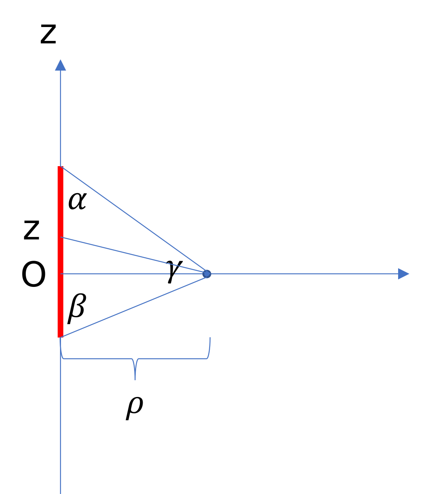

#

## 1번

$$
\begin{equation}
\begin{split}
\lambda&=\frac{c}{f}\\
&=\frac{3\times 10^8}{100\times 10^6}\\
&=3\text{ m}
\end{split}
\end{equation}
$$

이므로 답은 **3번**이다.

## 2번

원형 도선의 중심에서의 자계는 비오-사바르 법칙에 의해

$$
\begin{equation}
\begin{split}
\vec{H}&=\frac{\int I d\vec{l}\times \vec{a_r}}{4\pi r^2}\\
&=\frac{I\int_0^{2\pi} r d\phi \vec{a_\perp }}{4\pi r^2}\\
&=\frac{2\pi r I\vec{a_\perp }}{4\pi r^2}\\
&=\frac{I}{2r}\vec{a_\perp }
\end{split}
\end{equation}
$$

이다. 주어진 상황은 원형 도선의 $\frac{\alpha}{2\pi}$비율의 조각이 있는 상황이므로 자계벡터의 크기 또한 이 비율이 적용된다.
따라서

$$
\begin{equation}
\begin{split}
\vec{H_0}&=\frac{I}{2a}\frac{\alpha}{2\pi}\vec{a_\perp }\\
&=\frac{I}{4\pi a}\alpha \vec{a_\perp }
\end{split}
\end{equation}
$$

이므로 답은 **1번**이다.

## 3번

$$
E(z,t)=Re\left[ 100e^{j10^8 t}e^{j\left(-0.5z+\frac{\pi}{6}\right)} \right]
$$

이다.
페이저 형태에서는 공통적으로 나타나는 주파수 성분을 떼어낸 나머지 부분을 취급하므로

$$
100e^{j\left(-0.5z+\frac{\pi}{6}\right)}
$$

이고 답은 **3번**이다.

## 4번

폐곡면 $S$를 통과하는 전기선속은 그 안의 전하량에 비례하고 비례상수는

$$
\frac{1}{\epsilon}=\frac{1}{\epsilon_0}
$$

이다.
따라서

$$
\frac{(30-170+10)\times 10^{-9}}{\epsilon_0}=\frac{-130\times 10^{-9}}{\epsilon_0}
$$

이므로 답은 **2번**이다.

## 5번

경계면에 수직인 $D$ 성분은 같아야 하므로

$$
D_{2y}=-3
$$

$$
\begin{equation}
\begin{split}
\Rightarrow E_{2y}&=\frac{-3}{\epsilon\_{r2}\epsilon_0}\\
&=\frac{-3}{4\epsilon_0}
\end{split}
\end{equation}
$$

이다.

또한 경계면에 평행한 $E$ 성분은 같아야 하므로

$$
\begin{equation}
\begin{split}
E_{2x}&=E_{1x}\\
&=\frac{8}{\epsilon_{r1}\epsilon_0}\\
&=\frac{8}{2\epsilon_0}\\
&=\frac{4}{\epsilon_0}
\end{split}
\end{equation}
$$

이다. 합치면

$$
\vec{E_2}=\frac{4}{\epsilon_0}\vec{a_x}-\frac{3}{4\epsilon_0}\vec{a_y}
$$

이므로 답은 **2번**이다.

## 6번

$$
\begin{equation}
\begin{split}
\Phi&=\int \vec{B}\cdot d\vec{S}\\
&=\int_0^1 \int_0^1 3xy^2\vec{a_z}\cdot \vec{a_z}dxdy\\
&=\int_0^1 x dx \int_0^1 3y^2dy\\
&=\left(\left[\frac{1}{2}x\right]_0^1 \right)\left( \left[y^3\right]_0^1\right)\\
&=0.5
\end{split}
\end{equation}
$$

이므로 답은 **3번**이다.

## 7번

주어진 지점에서 원점에서 $P_1$방향 단위벡터는 $\vec{a_x}$이므로

$$
\vec{a_\rho}=\vec{a_x}
$$

이고 이 때 $\phi$가 회전하는 방향의 단위벡터는

$$
\vec{a_\phi}=\vec{a_y}
$$

이다.
따라서 이 지점에서는

$$
\vec{A}=3(\vec{a_\rho}-\vec{a_\phi})
$$

이고 답은 **1번**이다.

## 8번

자유공간에서 무한 균일 선전하가 만드는 전계벡터는 대칭성을 이용하면

$$
\begin{gather}
2\pi \epsilon_0 \rho E=\rho_l \\
\Rightarrow E=\frac{\rho_l}{2\pi \epsilon_0 \rho}
\end{gather}
$$

이다.
주어진 조건에서

$$
1.8\times 10^4=\frac{\rho_l}{2\pi\epsilon_0 \cdot 3}
$$

$$
\begin{equation}
\begin{split}
\Rightarrow \rho_l&=1.8\times 10^4 \times \frac{10\times 10^{-9}}{18}\cdot 3\\
&=3 \mu
\end{split}
\end{equation}
$$

이므로 답은 **2번**이다.

## 9번

$$
\begin{equation}
\begin{split}
I&=\frac{dQ}{dt}\\
&=\frac{d(V\rho_v)}{dt}\\
&=V\frac{d\rho_v}{dt}+\rho_v\frac{dV}{dt}\\
&=0+\rho_v\frac{d(\pi\cdot r^2 l)}dt\\
&=\rho_v\pi\cdot r^2\frac{dl}{dt}\\
&=\rho_v\pi\cdot r^2\cdot u\\
&=4\times 10^{-3}\pi\cdot (10^{-3})^2\cdot 10000\\
&=4\pi \times 10^{-5}\\
&=40\pi \mu
\end{split}
\end{equation}
$$

이므로 답은 **1번**이다.

## 10번

1. 정석적 풀이

   $$
   \begin{equation}
   \begin{split}
   d\vec{E}&=\frac{dQ}{4\pi\epsilon_0 r^2}\\
   &=\frac{\lambda \cdot dx}{4\pi\epsilon_0 r^3}\vec{r}
   \end{split}
   \end{equation}
   $$

   이다. 그리고 대칭성에 의해서 절반만 적분하면 되고, 또 $\vec{a_x}$성분은 상쇄되고 $\vec{a_y}$성분은 2배가 될 것이다.
   또한

   $$
   r^2=x^2+h^2
   $$

   이고

   $$
   \vec{r}=-x\vec{a_x}+h\vec{a_y}
   $$

   이므로 대입해서 적분하면

   $$
   \begin{equation}
   \begin{split}
   \vec{E}&=\frac{\lambda}{4\pi\epsilon_0}\int_0^L \frac{2h}{r^3}dx\vec{a_y}\\
   &=\frac{\lambda h}{2\pi\epsilon_0}\int_0^L \frac{1}{(x^2+h^2)^{\frac{3}{2}}}dx
   \end{split}
   \end{equation}
   $$

   이다.
   한편 $x=a tan\theta$로 놓으면

   $$
   dx=a sec^2\theta d\theta
   $$

   이므로

   $$
   \begin{equation}
   \begin{split}
   \int \frac{1}{(x^2+a^2)^{\frac{3}{2}}}dx&=\int \frac{a sec^2\theta d\theta}{2}{a^3\cdot \sqrt{a} (1+tan^2\theta)^{\frac{3}{2}}}\\
   &=\int \frac{sec^2\theta d\theta}{a^2 sec^3\theta}\\
   &=\int \frac{cos\theta}{a^2}d\theta\\
   &=\frac{sin\theta}{a^2}\\
   &=\frac{x}{a^2\sqrt{a^2+x^2}}
   \end{split}
   \end{equation}
   $$

   이다.
   이를 이용하면

   $$
   \begin{equation}
   \begin{split}
   \vec{E}&=\frac{\lambda h}{2\pi\epsilon_0}\int_0^L \frac{1}{(x^2+h^2)^{\frac{3}{2}}}dx\\
   &=\left[\frac{\lambda h}{2\pi\epsilon_0}\frac{x}{h^2\sqrt{x^2+h^2}}\right]_0 ^L\\
   &=\frac{\lambda}{2\pi\epsilon_0}\frac{L}{h\sqrt{L^2+h^2}}
   \end{split}
   \end{equation}
   $$

   이므로 답은 **1번**이다.

2. 빠른 풀이

   $L\to \infty$일 때 전계세기가

   $$
   \frac{\lambda}{2\pi\epsilon_0 h}
   $$

   가 되는 것을 찾는다. 가능한 것은 **1번** 뿐이다.

## 11번

$$
\begin{equation}
\begin{split}
\vec{AO}&=-\vec{OA}\\
&=-4\vec{a_x}+2\vec{a_y}-\vec{a_z}
\end{split}
\end{equation}
$$

이다.

단위벡터를 구하기 위해서는 위 벡터를 크기

$$
\sqrt{4^2+2^2+1^2}=\sqrt{21}
$$

로 나눠주면 되므로

$$
\vec{a_{AO}}=-\frac{4}{\sqrt{21}}\vec{a_x}+\frac{2}{\sqrt{21}}\vec{a_y}-\frac{1}{\sqrt{21}}\vec{a_z}
$$

이므로 답은 **3번**이다.

## 12번

대칭성에 의해 유효 전하는

$$
Q+Q+Q-Q=2Q
$$

이다.
꼭짓점에서 중심까지의 거리는

$$
\begin{equation}
\begin{split}
r&=\frac{d\sqrt{2}}{2}\\
&=\frac{d}{\sqrt{2}}
\end{split}
\end{equation}
$$

이다.
$Q$에 의한 전위는

$$
\begin{equation}
\begin{split}
V&=\frac{2Q}{4\pi \epsilon_0 r}\\
&=\frac{2Q\sqrt{2}}{4\pi d\epsilon_0 }\\
&=\frac{2Q\sqrt{2}}{4\pi d \epsilon_0}\\
&=\frac{Q}{\sqrt{2}\pi d \epsilon_0}
\end{split}
\end{equation}
$$

이므로 답은 **2번**이다.

## 13번

유도 기전력은

$$
emf=-\frac{d\Phi}{dt}
$$

이다.
주어진 조건에서

$$
\begin{equation}
\begin{split}
\Phi&=\int \vec{B}\cdot d\vec{S}\\
&=BS\\
&=10sin(10^3 t)\times 0.2\cdot 0.3\\
&=0.6sin(10^3 t)
\end{split}
\end{equation}
$$

이다. 대입하면

$$
emf=-600cos(10^3 t)
$$

이므로 $t=2$ ms에서 전류의 크기는

$$
\begin{equation}
\begin{split}
I&=\frac{600cos(10^3\cdot 2 \times 10^{-3})}{5000}\\
&=0.12 cos(2)
\end{split}
\end{equation}
$$

이므로 답은 **4번**이다.

## 14번

유한 도선에 의한 자계의 세기를 구해 보자.

도선이 $z$축 위에 있고, $xy$평면 위에 측정 지점이 있다고 하자. 그리고 측정 지점까지의 거리를 $\rho$라 하자.
그리고 한쪽 끝에서 측정 지점까지의 각도가 $\alpha$, 다른 끝에서 측정 지점까지의 각도가 $\beta$로 주어졌다고 하자.
그러면

$$
d\vec{H}=\frac{I}{4\pi}\frac{d\vec{l}\times \vec{a_\Re}}{\Re^2}
$$

이고

$$
d\vec{l}=dz\vec{a_z}
$$

이다.
그리고

$$
\Re=\sqrt{z^2+\rho^2}
$$

이므로

$$
\vec{a_\Re}=\frac{1}{\sqrt{z^2+\rho^2}}(\rho\vec{a_\rho}+z\vec{a_z})
$$

이다.
따라서

$$
\begin{equation}
\begin{split}
d\vec{H}&=\frac{I}{4\pi}\frac{1}{\Re^2}dz\vec{a_z} \times \frac{1}{\sqrt{z^2+\rho^2}}(\rho\vec{a_\rho}+z\vec{a_z})\\
&=\frac{I}{4\pi}\frac{\rho}{(z^2+\rho^2)^{\frac{3}{2}}}dz\vec{a_\phi}\\
&=\frac{I}{4\pi} cos(\gamma)\frac{1}{z^2+\rho^2}dz
\end{split}
\end{equation}
$$

인데,

$$
\begin{gather}
z=\rho tan(\gamma) \\
\Rightarrow dz=\rho sec^2(\gamma)d\gamma
\end{gather}
$$

이므로

$$
\begin{equation}
\begin{split}
d\vec{H}&=\frac{I}{4\pi} cos(\gamma)\frac{1}{\rho^2(1+tan^2(\gamma))}\rho sec^2(\gamma)d\gamma\vec{a_\phi}\\
&=\frac{I}{4\pi} cos(\gamma)\frac{1}{\rho^2sec^2(\theta)}\rho sec^2(\gamma)d\gamma\vec{a_\phi}\\
&=\frac{I}{4\pi} cos(\gamma)\frac{1}{\rho}d\gamma\vec{a_\phi}
\end{split}
\end{equation}
$$

이다.
따라서

$$
\begin{equation}
\begin{split}
\vec{H}&=\frac{I}{4\pi\rho}\int cos(\gamma)d\gamma\vec{a_\phi}\\
&=\frac{I}{4\pi\rho}sin(\gamma)\vec{a_\phi}
\end{split}
\end{equation}
$$

이다.(사실은 정적분해야한다.)
$sin(\gamma)$의 양 끝값을 바꾸면 각각 $cos(\alpha)$와 $-cos(\beta)$가 되므로 위 식에 대입하면

$$
\vec{H}=\frac{I}{4\pi\rho}(cos(\alpha)+cos(\beta))\vec{a_\phi}
$$

이다.

이를 이 문제 상황에 적용하면

$$
\alpha=\beta=\frac{\pi}{4}
$$

이므로 코사인 값은 둘 다

$$
cos\alpha=cos\beta=\frac{\sqrt{2}}{2}
$$

이고, 도선이 4개 있고 $\rho=\frac{d}{2}$이므로

$$
\begin{equation}
\begin{split}
H&=\frac{\sqrt{2}}{4\pi \frac{d}{2}}\left(2\cdot \frac{\sqrt{2}}{2}\cdot 4\right)\\
&=\frac{4}{\pi d}
\end{split}
\end{equation}
$$

이고 답은 **4번**이다.

## 15번

무손실 매질이므로 위상차이는 없다. 임피던스를 구하면

$$
\begin{equation}
\begin{split}
\eta&=\eta_0\sqrt{\frac{\mu_r}{\epsilon_r}}\\
&=120\pi\sqrt{\frac{2}{8}}\\
&=60\pi
\end{split}
\end{equation}
$$

이므로

$$
\begin{equation}
\begin{split}
H&=\frac{E}{\eta}\\
&=\frac{10}{60\pi}\\
&=\frac{1}{6\pi}
\end{split}
\end{equation}
$$

이다.
따라서 답은 **2번**이다.

## 16번

1. 옳다.
2. 에너지가 최소가 아니라면 최소가 될 때까지 움직일 것이므로 움직임이 없다는 것은 최소 에너지 상태라는 뜻이다.
3. 전계의 회전 성분이 없으므로 폐선적분 값도 $0$이다.
4. 회전 성분이 없는 장은 보존장이다.

따라서 **4번**이 옳지 않다.

## 17번

처음 커패시턴스를 $C_0$라 하자. 교체가 일어난 상황은 이를 반으로 가른 커패시터 두 개가 직렬연결된 것이다.
반쪽 커패시턴스는 거리가 절반으로 줄었으므로 $2C_0$이 될 것이고, 다른 반쪽 커패시턴스는 비유전율이 $9$배로 늘었으므로 $2\cdot 9C_0=18C_0$이다.
따라서 이 둘의 직렬 커패시턴스는

$$
\begin{equation}
\begin{split}
2C_0||18C_0&=\frac{36C_0}{20}\\
&=1.8C_0
\end{split}
\end{equation}
$$

이므로 답은 **2번**이다.

## 18번

1. 정재파비의 범위는 $[1,\infty)$이다. 특히 전송선로 끝이 개방되면 정재파만 존재하게 되므로 최소 진폭은 $0$이니 정재파비는 무한대가 된다.
2. 정합되면 정재파가 없으므로 최소 진폭과 최대 진폭이 같다. 따라서 정재파비는 $1$이다.
3. 정합되면 반사가 일어나지 않는다.
4. 반사 계수는
   $$
    \Gamma=\frac{Z_L-Z_0}{Z_L+Z_0}
   $$
   에서 $Z_L=\infty$이면 $\Gamma=1$이다.
   따라서 **1번**이 옳지 않다.

## 19번

원통형 도선이 만드는 자계세기는 대칭성에 의해

$$
\begin{gather}
2\pi \rho H=I\\
\Rightarrow H=\frac{I}{2\pi \rho}
\end{gather}
$$

이다.
$\frac{r}{2}$ 떨어진 곳에서는 전류가

$$
I\times\frac{\pi \left(\frac{r}{2}\right)^2}{\pi r^2}=\frac{I}{4}
$$

이므로

$$
\begin{equation}
\begin{split}
H_{\frac{r}{2}}=\frac{\frac{I}{4}}{2\pi \frac{r}{2}}=\frac{I}{4\pi r}
\end{split}
\end{equation}
$$

이다.
$2r$ 떨어진 곳에서는 전류는 전체 전류인 $I$이므로

$$
\begin{equation}
\begin{split}
H_{2r}=\frac{I}{2\pi 2r}=\frac{I}{4\pi r}
\end{split}
\end{equation}
$$

이다.
따라서 두 자계세기가 같으므로 비율은 $1$이다.

## 20번

$$
\vec{T}=\vec{m}\times\vec{H}
$$

이므로 회전력의 크기는 $MH$이고 답은 **1번**이다.
