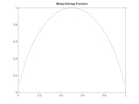
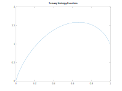
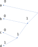

#

## 1번

각 시스템의 연산을 $L(\cdot)$이라 하자.\\
먼저 각 시스템의 선형성을 확인하자.

1.  $$
        \begin{equation}
        \begin{split}
            L(vx_1(t)+wx_2(t))&=a(vx_1(t)+wx_2(t))\\
            &=avx_1(t)+awx_2(t)=vax_1(t)+wax_2(t)\\
            &=vL(x_1(t))+wL(x_2(t))
        \end{split}
        \end{equation}
    $$
    이므로 선형성이 있다.
2.  $$
        \begin{equation}
        \begin{split}
            L(vx_1(t)+wx_2(t))&=a^t(vx_1(t)+wx_2(t))\\
            &=a^tvx_1(t)+a^twx_2(t)=va^tx_1(t)+wa^tx_2(t)\\
            &=vL(x_1(t))+wL(x_2(t))
        \end{split}
        \end{equation}
    $$
    이므로 선형성이 있다.
3.  $$
                \begin{equation}
                \begin{split}
                    L(vx_1(t)+wx_2(t))&=\frac{d}{dt}(vx_1(t)+wx_2(t))\\
                    &=\frac{d}{dt}(vx_1(t))+\frac{d}{dt}(wx_2(t))\\
                    &=v\frac{d}{dt}x_1(t)+w\frac{d}{dt}x_2(t)\\
                    &=vL(x_1(t))+wL(x_2(t))
                \end{split}
                \end{equation}
    $$
    이므로 선형성이 있다.
4.  $$
    \begin{equation}
    \begin{split}
    L(vx_1(t)+wx_2(t))&=vx_1(t)+wx_2(t)+vx_1(t+1)+wx_2(t+1)\\
    &=v(x_1(t)+x_1(t+1))+w(x_2(t)+x_2(t+1))\\
    &=vL(x_1(t))+wL(x_2(t))
    \end{split}
    \end{equation}
    $$
    이므로 선형성이 있다.

다음으로 시불변성을 확인하자.

1.  $$
     L(x(t-T))=ax(t-T)=y(t-T)
    $$
    이므로 시불변성이 있다.
2.  $$
    L(x(t-T))=a^tx(t-T)\neq y(t-T)=a^{t-T}x(t-T)
    $$
    이므로 시불변성이 없다.
3.  $$
    L(x(t-T))=\frac{d}{dt}x(t-T)=y(t-T)
    $$
    이므로 시불변성이 있다.
4.  $$
     L(x(t-T))=x(t-T)+x(t-T+1)=y(t-T)
    $$
    이므로 시불변성이 있다.

따라서 답은 **2번**이다.

## 2번

이진 확률 변수의 정보량(Binary Entropy Function) $H(p)$는 정보 엔트로피로서

$$
H(p)=-p log_2{p}-(1-p)log_2{(1-p)}
$$

이다.

$p$로 미분하면

$$
\begin{equation}
\begin{split}
 \frac{dH(p)}{dp}&=-log_2{p}-1+log_2{(1-p)}+1\\
    &=log_2{\frac{1-p}{p}}
\end{split}
\end{equation}
$$

이다.

$$
 \frac{dH(p)}{dp}=log_2{\frac{1-p}{p}}=0
$$

를 풀어보면

$$
\begin{gather}
\frac{1-p}{p}=1\\
\Rightarrow p=1-p\\
\Rightarrow p=1/2
\end{gather}
$$

이고, $p\lt\frac{1}{2}$이면 $+$, $p\gt\frac{1}{2}$이면 $-$의 부호를 가진다.
따라서 $\cap$형태의 모양, 즉 오목 함수 형태이다. 실제 그래프는 아래와 같다.

이러한 형태의 그래프가 그려지는 함수를 오목 함수라고 한다. 또한 바로 알 수 있듯이 $p=0.5$에서 최댓값, $p=0$ 혹은 $p=1$일 때 최솟값을 가진다.
그 이유로는 $p=0.5$일 때가 가장 애매하니 불확실성(정보량)이 많고, 또 확률이 $0$ 또는 $1$이 되면 불확실성이 완전히 제거되니(어떤 사건이 절대 일어나지 않거나 반드시 일어나니까) 정보량이 $0$이 되는 것이다.

남는 것은 **4번**인데, 이 경우의 그래프는 다음과 같다.

그래프에서 볼 수 있듯이 이진 확률 변수의 정보량이 주어진 삼진 확률 변수의 정보량보다 항상 큰 것은 아니다.
이는 세 가지 경우를 갖는 삼진 확률 변수가 더 불확실할 수 있기 때문일 것이다.

## 3번

섀넌 채널 용량은

$$
C=W log_2{(1+SNR)}=W log_2{\left(1+\frac{P}{N_0W}\right)}
$$

이다. 따라서 $T$ 동안 보낼 수 있는 정보량은 여기에 $T$를 곱하면 되므로

$$
WTlog_2{\left(1+\frac{P}{N_0W}\right)}
$$

인 **4번**이 답이다.

## 4번

어떤 심볼을 전송할 확률 변수를 $T$, 수신할 확률 변수를 $R$이라 하자. 주어진 조건으로부터

$$
\begin{gather}
P(R=0|T=0)=1-p, P(R=1|T=0)=p\\
P(R=2|T=2)=1-q, P(R=1|T=2)=q\\
\end{gather}
$$

이다. 구해야 할 확률은

$$
\begin{equation}
\begin{split}
  P(R=1)&=P(R=1|T=0)P(T=0)\\
    &+P(R=1+T=2)P(T=2)\\
    &=p\cdot 0.5+q\cdot 0.5\\
    &=0.5(p+q)
\end{split}
\end{equation}
$$

이므로 답은 **2번**이다.

## 5번

1. 잘은 모르겠으나 <a href="http://www.rfdh.com/tech/cdma/cdma_basic_prop.htm">RF 디자인 하우스의 글</a>을 참고하니 간섭에 약하다고 한다.
   아무래도 동일한 주파수 대역을 여러 사용자들이 쓰다보니 그런 게 아닐까?
2. 소프트 핸드오프가 가능하다.(사실 모든 통신방식이 다 가능하긴 하다고 한다.)
3. 각 사용자가 겹치는 시간 영역을 사용한다.
4. 주파수 대역도 겹쳐서 사용하고, 코드만 다르게 한다.

답은 **1번**이다.

## 6번

아무리 많은 안테나로 보내도 받는 안테나가 적으면 적은 쪽에 맞춰질 수밖에 없을 것이다. 반대의 경우도 마찬가지이다.
따라서 답은 $12$와 $2$ 중 작은 값인 $2$에 해당하는 **1번**이다.

## 7번

신호들이 직교하려면 각 신호들을 곱해서 $T$ 구간으로 적분했을 때 (진폭은 생략하겠다)

$$
\begin{equation}
\begin{split}
 \int_0^T cos(2\pi(f_c+m\varDelta f)t)\times cos(2\pi(f_c+(m+1)\varDelta f)t)dt&=\frac{1}{2}\int_0^T(cos(2\pi(f_c+m\varDelta f+f_c+(m+1)\varDelta f))t)+cos(2\pi(f_c+m\varDelta f-f_c-(m+1)\varDelta f)t))dt\\
    &=\frac{1}{2}\int_0^T(cos(2\pi(2f_c+(2m+1)\varDelta f)t)+cos(2\pi(-\varDelta f)t))dt\\
    &=0
\end{split}
\end{equation}
$$

이 되어야 한다.
$\varDelta f$를 최소로 하면서 위를 만족하기 위해서는 우선 두 번째 항이 코사인의 반주기에 대한 적분이 되어야 한다.
따라서

$$
\varDelta f=\frac{1}{2T}
$$

이므로 답은 **1번**이다. 그리고 첫 번째 적분항도 $0$이 되도록 적당히 $f_c$를 설정하게 된다.

## 8번

1. FM은 AM 대비 진폭 잡음에 더 강하다. 진폭을 일정하게 리미팅하기 때문이다.
2. SSB-SC는 전송대역폭과 신호대역폭이 동일하여 DSB 대비 더 대역폭 효율적이다.
3. DSB-TC는 반송파를 이용해서 포락선 검파가 가능하므로 SC 방식보다 간단하다.
4. 하지만 이 반송파 성분 때문에 추가 전력이 필요하므로 효율성이 나쁘다.

따라서 답은 **4번**이다.

## 9번

그림을 그려서 풀 수도 있겠지만, 수식적으로 풀어 보자.

주어진 식을 $\alpha$로 미분한 값이 $0$이 되게 하는 식을 찾으면 극값이 될 것이고, 아마도 이 극값이 최솟값일 것이다.
계산해보면

$$
  \frac{d}{d\alpha}\left(P(s_1)\int_{-\infty}^{\alpha}f(y|s_1)dy\right.\left.+P(s_2)\int_{\alpha}^{\infty}f(y|s_2)dy\right)=P(s_1)f(\alpha|s_1)-P(s_2)f(\alpha|s_2)=0
$$

이므로 답은 **2번**이다.

## 10번

$$
 10log_{10} {\frac{1}{10^{-3}}}=30 dB
$$

이다. 따라서 $10$ km 떨어진 것이므로 답은 **2번**이다.

## 11번

1. 같을 리가 없다.
2. 오류 검출이 가능한 범위인 $e_d$는 한 심볼에서 다른 심볼까지의 최소 해밍 거리 미만이다.
   만약 완전히 다른 심볼로 가 버린다면 오류가 너무 많이 생긴 것인지 아니면 그 심볼이 원래 의도된 것인지 알 수가 없다.
3. 오류 정정이 가능한 범위인 $e_c$는 한 심볼에서 다른 심볼까지의 최소 해밍 거리의 절반 미만이다.
   그러면 그 거리를 반지름으로 갖는 구 안의 오류 있는 심볼은 정확한 심볼인 구의 중심으로 정정할 수 있다.
4. $e_c$는 $e_d$보다 항상 작거나 같다.

따라서 답은 **3번**이다.

## 12번

허프만 부호화 과정은 아래와 같다.

따라서 d에 해당하는 부호는 111이므로 답은 **4번**이다.

## 13번

BPSK 시스템이므로 비트 당 에너지는

$$
E_b=\frac{A^2T}{2}
$$

이고, 심볼 간 거리는

$$
d=2\cdot \sqrt{E_b}
$$

이다. 심볼률과 같은 값인 비트전송률이 $1$ Mbits/s이므로 비트 지속 시간은 $10^{-6}$ s이다.

비트 오류율은

$$
Q\left(\frac{d/2}{\sigma}\right)
$$

이고,

$$
\begin{equation}
\begin{split}
  d/2&=A\cdot\sqrt{\frac{T}{2}}\\
    &=10^{-2}\cdot\sqrt{\frac{10^{-6}}{2}}\\
    &=\frac{10^{-5}}{\sqrt{2}}
\end{split}
\end{equation}
$$

이다. 그리고

$$
 \sigma=\sqrt{\frac{N_0}{2}}=\sqrt{\frac{10^{-11}}{2}}
$$

을 대입하면

$$
\begin{equation}
\begin{split}
    BER&=Q\left(\frac{10^{-5}}{\sqrt{2}}\cdot \frac{\sqrt{2}}{\sqrt{10^{-11}}}\right)\\
    &=Q(\sqrt{10})
\end{split}
\end{equation}
$$

이고 답은 **3번**이다.

## 14번

$$
  G=
\begin{bmatrix}
    P&I
\end{bmatrix}
$$

이므로 패리티 검사 행렬은

$$
  H=
\begin{bmatrix}
    I\\
    P
\end{bmatrix}
=
\begin{bmatrix}
    1&0&0\\
    0&1&0\\
    0&0&1\\
    1&1&0\\
    0&1&1\\
    1&0&1
\end{bmatrix}
$$

이다.

한편 신드롬은

$$
\begin{equation}
\begin{split}
 S&=rH=
\begin{bmatrix}
    0&0&1&1&1&0
\end{bmatrix}
\begin{bmatrix}
    1&0&0\\
    0&1&0\\
    0&0&1\\
    1&1&0\\
    0&1&1\\
    1&0&1
\end{bmatrix}\\
&=
\begin{bmatrix}
    1&0&0
\end{bmatrix}
\end{split}
\end{equation}
$$

이므로 답은 **3번**이다.

## 15번

$$
 \frac{2\pi}{16}=\frac{\pi}{8}
$$

이므로 답은 **1번**이다.

## 16번

나열된 특성들은 물리적인 성질들이므로 답은 **2번**이다.

## 17번

코사인 함수의 인자로 들어가 있는 메시지 신호를 꺼내기 위해서는 우선 미분을 해서 앞으로 꺼내져 곱해지게 해야 한다.
그렇게 되면

$$
x'(t)=-A(2\pi f_c+\theta'(t))sin(2\pi f_ct+\theta(t))
$$

가 된다.
여기서 포락선 검파를 하면 DC 성분이 더해진 $\theta'(t)$가 나오므로, 이를 적분하면 원래 메시지 $\theta(t)$가 복원된다.
따라서 필요 없는 것은 위상이동기이므로 **4번**이 답이다.

## 18번

$q$단계로 양자화한다는 것은 $log_2 q$ 비트를 쓴다는 뜻이다. 한편 대역폭이 $W$인 메시지 신호는 $2W$ 이상으로 양자화해야한다.
이로부터

$$
B\propto Wlog_2 q
$$

이므로 답은 **1번**이다.

## 19번

1. 레벨이 $32$개이므로 샘플 당 비트 수는
   $$
   log_2{32}=5 \text{ b}
   $$
   이상 필요하다.
2. 나이퀴스트 주파수는 최대 주파수의 2배이므로
   $$
   f_s=4,000 \text{ samples/s}
   $$
   가 맞다. 최종 비트 전송률 $R$은 여기에 샘플 당 비트를 곱한 값이므로
   $$
   R=20,000 \text{bits/s}
   $$
   로 옳다.
3. 대역폭 효율은 단위 대역폭 당 비트 전송률이므로
   $$
    20000/12000=20/12=5/3\fallingdotseq 1.67 \text{ bits/s/Hz}
   $$
   이다.
4. 심볼 전송률은 나이퀴스트 주파수와 같은 $4,000$ symbol/s이다.

따라서 **3번**이 옳지 않다.

## 20번

독립의 정의인

$$
P(A\cap B)=P(A)P(B)
$$

를 만족하는지 따져 보자.

1. 교집합은 공집합이고, 각각의 집합은 공집합이 아니므로

   $$
     0\neq \frac{1}{3}\cdot \frac{1}{3}
   $$

   이다.

2. 교집합은 공집합이고, 사건 중 하나가 공집합이므로 다른 어떤 사건이 온다 할지라도 각 사건의 확률의 곱은 $0$이다. 따라서 $0=0$으로 독립이다.
3. 교집합은 ${2}$이므로 확률은 $\frac{1}{6}$이다. 한편 두 사건의 확률의 곱은

   $$
   \frac{2}{6}\cdot \frac{3}{6}=\frac{1}{6}
   $$

   이므로 독립이다.

4. 한 사건이 전체 샘플 공간이므로 그 확률값은 $1$이다. 따라서 두 사건의 확률의 곱은 다른 사건 하나의 곱과 같을 수밖에 없으므로 독립이다.

따라서 답은 **1번**이다.
