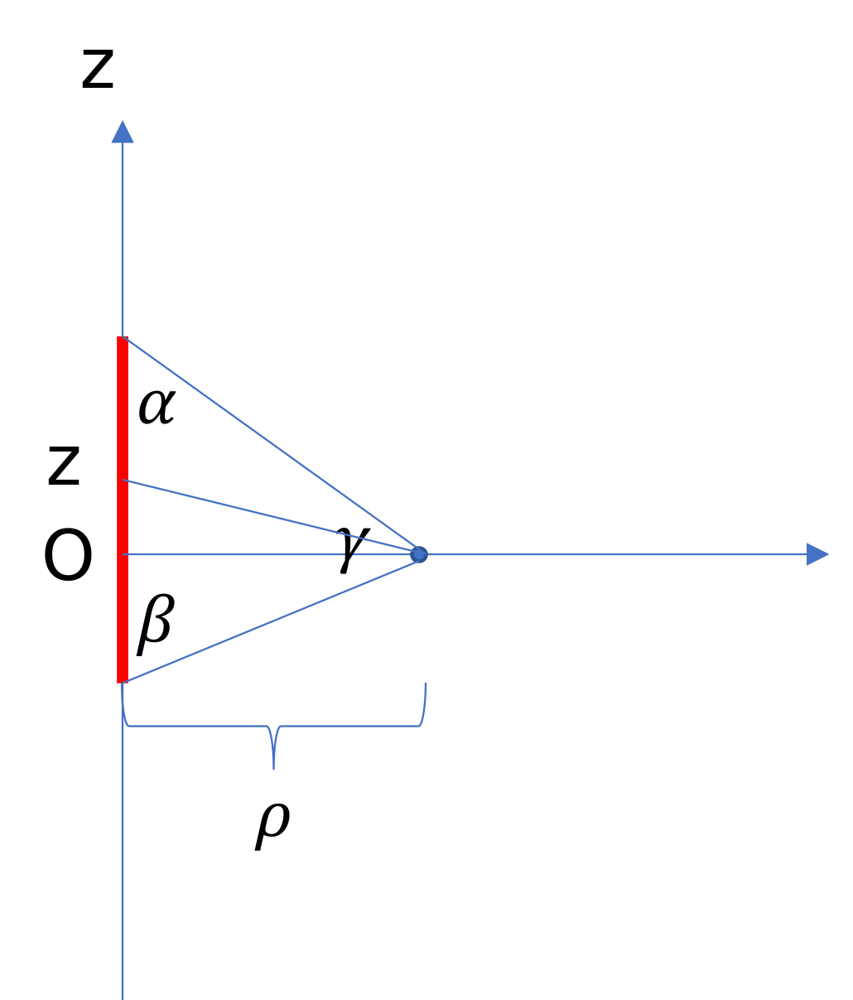

#

## 1번
$-Q$ 2개에 의해서 생기는 북서쪽 방향의 힘이 $2Q$ 전하에 의해 생기는 남동쪽 힘보다 크다.
$2Q$ 전하의 거리가 $\sqrt{2}$배인 것이 제곱되어서 나타나기 때문에 두 힘의 비율은
$$
\frac{Q}{\sqrt{2}}:\frac{2Q}{2}=\sqrt{2}:1
$$
이다.
따라서 답은 **1번**이다.

## 2번
$$
\begin{equation}
\begin{split}
\vec{E} &=-\nabla V \\
&= -\vec{a_z} (-5-5)/(4\cdot 10^{-2})\\
&=250\vec{a_z}
\end{split}
\end{equation}
$$
이므로 답은 **3번**이다.

## 3번
2. 정전계에서
   $$   
   \oint \vec{E}\cdot d\vec{l}=0
   $$
   이다.
3. 그렇다. 도체의 표면전하가 전계를 법선 방향으로 만들기 때문이다.

따라서 답은 **2번**이다.

## 4번
자기에너지는
$$
W=\iiint \frac{1}{2}\vec{B}\cdot \vec{H} dv
$$
이고 등방, 선형인 자성체이므로 자기에너지밀도는
$$
\frac{BH}{2}
$$
이다. 따라서 답은 **1번**이다.

## 5번
강자성체에 대한 설명이므로 **3번**이 답이다.

## 6번
점전하가 만드는 전속밀도벡터는
$$
\vec{D}=\frac{Q}{4\pi r^2}\vec{a_r}
$$
이다. 주어진 영역에 대해서 전속을 구하면
$$
\begin{equation}
\begin{split}
\int _{\frac{\pi}{3}} ^{\frac{\pi}{2}} \int _{0} ^{2\pi} \frac{2}{4\pi r^2} r^2 sin\theta d\phi d\theta&=\int _{\frac{\pi}{3}} ^{\frac{\pi}{2}}\frac{1}{2\pi}\cdot 2\pi sin\theta d\theta\\
&=\int _{\frac{\pi}{3}} ^{\frac{\pi}{2}}sin\theta d\theta\\
&=\left[-cos\theta\right]_{\frac{\pi}{3}}^{\frac{\pi}{2}}\\
&=cos\frac{\pi}{3}\\
&=\frac{1}{2}
\end{split}
\end{equation}
$$
이므로 답은 **2번**이다.

## 7번
전속밀도벡터와 전계와 분극벡터의 관계는
$$
\vec{D}=\epsilon \vec{E}=\epsilon_0\vec{E}+\vec{P}
$$
이다.
이 식의 의미는 분극이 없다고 가정할 수 있는 자유공간에서의 전속밀도는 분극이 있는 유전체 내에서는 반대 방향의 전기장을 만드는 분극에 의해서 줄어들어 버리기 때문에 이를 보충해서 순수 전하에 의한 전속밀도를 구한다는 뜻이다.
전하에 의한 전속밀도는 분극과 상관없어야 하니까.
이제 분극벡터를 구해보면
$$
\vec{P}=\vec{D}-\epsilon_0\vec{E}
$$
이고, 대칭성에 의해
$$
\vec{D}=\frac{\rho_l}{2\pi \rho}\vec{a_\rho}, \vec{E}=\frac{\rho_l}{2\pi \epsilon \rho}\vec{a_\rho}
$$
이므로
$$
\vec{P}=\frac{\rho_l}{2\pi\rho}\left(1-\frac{\epsilon_0}{\epsilon}\right)\vec{a_\rho}
$$
가 된다. 따라서 답은 **4번**이다.

## 8번
커패시터 4개가 병렬 연결되어 있는 것과 같다. 처음에 모두 같은 유전체라 가정하고, $\rho_l$의 밀도로 전하가 쌓여 있다고 가정하자.
이 때 전압은
$$
V=\int \vec{E}\cdot d\vec{l}
$$
인데, 전기장은 앞 문제에 나와있다. 대입하여서 구하면
$$
V=\frac{\rho_l}{2\pi\epsilon}ln\frac{b}{a}
$$
이다. 그리고
$$
Q=CV
$$
이므로
$$
\begin{equation}
\begin{split}
C&=\frac{Q}{V}=\rho_l \cdot L \times\frac{1}{ \left(\frac{\rho_l}{2\pi\epsilon}ln\frac{b}{a}\right)}\\
&=2\pi\epsilon\cdot L \times\frac{1}{ln\frac{b}{a}}\\
&=\frac{ 12\pi\epsilon }{ln2}
\end{split}
\end{equation}
$$
이다.
이 값은 앞서 말했듯이 균일한 유전체로 꽉 채워져 있을 경우이므로, 4로 나누고 유전율을 각각 바꿔서 계산한 다음에 다 더해주면 될 것이다.
계산하면
$$
\begin{equation}
\begin{split}
\frac{3\pi\epsilon_0}{ln2}(2+4+8+16)&=\frac{3\pi\epsilon_0}{ln2}\cdot 30\\
&=\frac{90\pi\epsilon_0}{ln2}
\end{split}
\end{equation}
$$
이고 답은 **3번**이다.

## 9번
전기에너지는
$$
W=\frac{1}{2}\iiint \vec{E}\cdot \vec{D} dv
$$
이다. 주어진 조건을 이용하여 계산하고
$$
\begin{gather}
\vec{E}=-\nabla V \\
\Rightarrow E=\frac{V}{d}
\end{gather}
$$
임을 이용하면
$$
W=\frac{1}{2}\int_0^d \epsilon S (V/h)^2 dh
$$
이다. 한편
$$
W=\int \vec{F}\cdot d\vec{l}
$$
이고 주어진 상황에서 $d\vec{l}=d\vec{h}$이다. 따라서 $W$를 $d$로 미분하면 힘을 구할 수 있을 것이고, $d$로 정적분하고 있으니 $h$ 자리에 $d$가 들어가면 답이 나온다.
최종 결과는
$$
W=\frac{1}{2}\epsilon S\left(\frac{V}{d}\right)^2
$$
이므로 답은 **2번**이다.

## 10번
유한 도선에 의한 자계의 세기를 구해 보자.

도선이 $z$축 위에 있고, $xy$평면 위에 측정 지점이 있다고 하자. 그리고 측정 지점까지의 거리를 $\rho$라 하자.
그리고 한쪽 끝에서 측정 지점까지의 각도가 $\alpha$, 다른 끝에서 측정 지점까지의 각도가 $\beta$로 주어졌다고 하자.
그러면
$$
\vec{dH}=\frac{I}{4\pi}\frac{d\vec{l}\times \vec{a_\Re}}{\Re^2}
$$
이고 $\vec{dl}=dz\vec{a_z}$이다.
그리고 $\Re=\sqrt{z^2+\rho^2}$이므로
$$
\vec{a_\Re}=\frac{1}{\sqrt{z^2+\rho^2}}(\rho\vec{a_\rho}+z\vec{a_z})
$$
이다.
따라서
$$
\begin{equation}
\begin{split}
\vec{dH}&=\frac{I}{4\pi}\frac{1}{\Re^2}dz\vec{a_z} \times \frac{1}{\sqrt{z^2+\rho^2}}(\rho\vec{a_\rho}+z\vec{a_z})\\
&=\frac{I}{4\pi}\frac{\rho}{(z^2+\rho^2)^{\frac{3}{2}}}dz\vec{a_\phi}\\
&=\frac{I}{4\pi} cos(\gamma)\frac{1}{z^2+\rho^2}dz
\end{split}
\end{equation}
$$
이다. 또한
$$
z=\rho tan(\gamma) \Rightarrow dz=\rho sec^2(\gamma)d\gamma
$$
이므로
$$
\begin{equation}
\begin{split}
\vec{dH}&=\frac{I}{4\pi} cos(\gamma)\frac{1}{\rho^2(1+tan^2(\gamma))}\rho sec^2(\gamma)d\gamma\vec{a_\phi}\\
&=\frac{I}{4\pi} cos(\gamma)\frac{1}{\rho^2sec^2(\theta)}\rho sec^2(\gamma)d\gamma\vec{a_\phi}\\
&=\frac{I}{4\pi} cos(\gamma)\frac{1}{\rho}d\gamma\vec{a_\phi}
\end{split}
\end{equation}
$$
이다.
따라서
$$
\vec{H}=\frac{I}{4\pi\rho}\int cos(\gamma)d\gamma\vec{a_\phi}=\frac{I}{4\pi\rho}sin(\gamma)\vec{a_\phi}
$$
이다.(사실은 정적분해야한다.)
$sin(\gamma)$의 양 끝값을 바꾸면 각각 $cos(\alpha)$와 $-cos(\beta)$가 되므로 위 식에 대입하면
$$
\vec{H}=\frac{I}{4\pi\rho}(cos(\alpha)+cos(\beta))\vec{a_\phi}
$$
이다.
구한 공식을 이 문제 상황에 적용하면, 변의 길이가 $a$인 도선의 양 끝에서의 각도는 $60^\circ$이고, 중심까지의 거리는 $\frac{\sqrt{3}}{2}a$이고 또 2개가 있으므로
$$
\begin{equation}
\begin{split}
\vec{H_a}&=2\cdot \frac{I}{4\pi\frac{\sqrt{3}}{2}a}(2cos(60^\circ))\\
&=\frac{I}{\sqrt{3}\pi a}
\end{split}
\end{equation}
$$
이다.
그리고 변의 길이가 $\sqrt{3}a$인 도선의 양 끝에서의 각도는 $30^\circ$이고, 중심까지의 거리는 $\frac{a}{2}$이고 또 2개가 있으므로
$$
\begin{equation}
\begin{split}
\vec{H_{\sqrt{3}a}}&=2\cdot \frac{I}{4\pi\frac{a}{2}}(2cos(30^\circ))\\
&=\sqrt{3}\frac{I}{\pi a}
\end{split}
\end{equation}
$$
이다. 둘을 더해서 크기를 구하면
$$
H=\frac{I}{\pi a}\left(\frac{1}{\sqrt{3}}+\sqrt{3}\right)
$$
이므로 답은 **4번**이다.
그리고
$$
\vec{H}=\frac{I}{4\pi\rho}(cos(\alpha)+cos(\beta))\vec{a_\phi}
$$
이 식은 유용하므로 외워두는 것을 추천한다.

## 11번
인덕턴스는 흐르는 전류 대비 쇄교하는 자기력선 수의 비율이다. 따라서 전류를 증가시키는 것은 의미가 없으므로 답은 **4번**이다.
코일 감은 수를 늘리면 그만큼 더 많은 자속이 생길 것이고, 반지름을 늘리면 면적이 늘어나니 자기력선 수도 늘어난다. 자성체의 비투자율을 늘려도 전류에 반응해서 생기는 자기장이 강해질 것이다.

## 12번
$$
Z_{in}=Z_0\frac{Z_L+jZ_0tan(kl)}{Z_0+jZ_Ltan(kl)}
$$
이고 $Z_L=0$이므로 계산하면
$$
\begin{equation}
\begin{split}
Z_{in}&=Z_0\frac{jZ_0tan(kl)}{Z_0}\\
&=jZ_0tan(kl)
\end{split}
\end{equation}
$$
이므로 답은 **3번**이다.

이 식을 비교적 쉽게 외우는 방법을 소개하겠다. 일단 기본적인 몇 가지는 외워야 한다. 분자와 분모의 형태가 $a+jbtan(\beta l)$형태라는 것, 분수 앞에 어떤 상수 $c$가 곱해지는 것, 그리고 $Z_0$과 $Z_L$이 어딘가에 들어가야 한다는 것이다.
다음으로, 로드의 위치가 $l=0$에 있을 때를 생각해보자. 이 때는 전송선로 없이 바로 연결한 것과 마찬가지이므로 $Z_{in}=Z_L$이다. 그리고 $jtan(\beta l)=jtan 0=0$이다.
이에 따라, $c\cdot \frac{\text{(분자 실수항)}}{\text{(분모 실수항)}}=Z_L$이 되려면 분모의 실수항과 $c$가 $Z_0$이 되고, 분자 실수항은 $Z_L$이면 적절할 것 같다.
마지막으로, 분자와 분모의 $Z_0$과 $Z_L$이 대각선 방향으로 위치하게 하면 식이 완성된다. 써놓고 보니 그리 쉽진 않지만, 그래도 몇 번 따라하다 보면 외우는 데 도움이 되리라 생각한다.

## 13번
점 $P$에서 전류는 북서쪽 방향으로 흐른다. 이에 따라 $dl$의 원 바깥쪽에서는 자기장이 약간 상쇄되고, 원 안쪽에서는 약간 더 강해진다.
이러한 에너지 차이가 있을 경우 에너지가 큰 쪽에서 작은 쪽으로 힘이 생기기 때문에 벡터 $\vec{OP}$ 방향으로 힘을 받는다. 따라서 답은 **1번** 이다.

## 14번
전류가 흐르는 면적을 통과하는 자속을 생각해보자. 전류 $I$를 흘리면 대칭성에 따라 주어진 공간에는
$$
H=\frac{I}{2\pi \rho}
$$
의 자계가 생기고, 높이 $L$과 양 끝점이 각각 $a,b$인 직사각형을 통과하는 자기력선은 다음과 같다.
$$
\begin{equation}
\begin{split}
\Phi&=\iint \mu_0\vec{H}\cdot d\vec{S}\\
&=\int _0 ^L \int _a ^b \frac{\mu_0I}{2\pi \rho} d\rho dh\\
&=\frac{\mu_0LI}{2\pi}ln\left(\frac{b}{a}\right)
\end{split}
\end{equation}
$$
따라서 단위길이당 자기 인덕턴스는
$$
\frac{\Phi}{LI}=\frac{\mu_0}{2\pi}ln\left(\frac{b}{a}\right)
$$
이므로 답은 **3번**이다.

## 15번
1. 초음파는 공기의 진동이지 전자기파가 아니다.
2. 와이파이는 GHz 대의 전파를 쓰므로 계산해보면 수십 센티미터의 파장이다. 가시광선의 파장은 수백 나노미터 단위이므로 와이파이 전파의 파장이 훨씬 길다.
3. 매질에 따라 전자기파의 속도는 달라진다.
4. 위상이 다를 뿐 수직이긴 하다.

따라서 답은 **2번**이다.

## 16번
직선은 $x$축 위에 놓여있다. 면전류에 의한 자계는 $-4\vec{a_y}$이다. 따라서 선전류는 $\vec{a_x}$ 방향으로 흘러야 상쇄시킬 수 있으며, 그 크기는
$$
\begin{gather}
4=\frac{I}{2\pi \cdot 2}\\
\Rightarrow I=16 \pi
\end{gather}
$$
이다. 따라서 답은 **4번**이다.

## 17번
로렌츠 힘은
$$
\vec{F}=q(\vec{v}\times \vec{B}+\vec{E})
$$
이다. 단위전하당 자기장에 의한 힘을 계산하면
$$
\vec{F_B}/q=10^{5-3}(-100\vec{a_y}+60\vec{a_z}-120\vec{a_x})
$$
이다. 따라서
$$
\begin{equation}
\begin{split}
\vec{E}&=-\vec{F_B}/q\\
&=12\vec{a_x}+10\vec{a_y}-6\vec{a_z}
\end{split}
\end{equation}
$$
이므로 답은 **2번**이다.

## 18번
1. 서로 자기장을 더 많이 주고받으므로 상호 인덕턴스가 증가한다.
2. 사각형 면적이 작아져서 자기력선 수도 적어지므로 상호 인덕턴스는 감소할 것이다.
3. 위와 같다.
4. 인덕턴스는 전류 대비 자기력선 수의 비이기 때문에 전류를 크게 하면 자기력선 수도 같이 커져서 그 비율은 변하지 않는다.

따라서 **4번**이 옳지 않다.

## 19번
우선 $\vec{a_z}$ 방향 성분은 같아야 한다. 그래야 발산하지 않으니까. 이로부터 답이 될 수 있는 것은 3, 4번 중 하나임을 알 수 있다.
다음으로, 매질 I 영역에서 $z$평면에 평행한 자속의 크기는
$$
\frac{\sqrt{2^2+4^2}}{4}=\frac{\sqrt{5}}{2}
$$
이다. 3번의 경우 $z$평면에 평행한 자속 크기는
$$
\frac{\sqrt{2^2+5^2}}{7}=\frac{\sqrt{29}}{7}
$$
이니 가망이 없다.
확실히 하기 위해 4번에 대해서도 계산해보면
$$
\frac{\sqrt{\left(\frac{7}{2}\right)^2+7^2}}{7}=\sqrt{\frac{5}{4}}=\frac{\sqrt{5}}{2}
$$
이므로 확실히 **4번**이 답이다.

## 20번
$$
P=\frac{1}{2}\frac{V^2}{R}
$$
이므로 대입해서 구하면
$$
\begin{equation}
\begin{split}
P&=\frac{1}{2}\frac{50^2}{50}\\
=25 \text{ W}
\end{split}
\end{equation}
$$
이다.

## 21번
전자기파는 $+\vec{a_z}$방향으로 진행하고 있다. 무손실 유전체이므로 전계와 자계 위상은 같다.
한편 임피던스를 구하면
$$
\begin{equation}
\begin{split}
\eta&=\sqrt{\frac{\mu}{\epsilon}}\\
&=\eta_0\cdot\sqrt{\frac{2}{18}}\\
&=\frac{\eta_0}{3}\\
&=40\pi
\end{split}
\end{equation}
$$
이다. 따라서
$$
\begin{equation}
\begin{split}
\vec{H}&=\frac{E}{\eta}\vec{a_y}\\
&=cos(2\times 10^7t-kz)\vec{a_y}
\end{split}
\end{equation}
$$
이다.
한편 $k=\frac{\omega}{v}$이고 $\omega=2\times 10^7$ rad/s이므로 계산하면
$$
\begin{equation}
\begin{split}
k&=\frac{2\times 10^7\times \sqrt{18\times 2}}{3\times 10^8}\\
&=0.4
\end{split}
\end{equation}
$$
이므로 답은 **1번**이다.

## 22번
비유전율이 $100$이므로 위상 속도는
$$
\begin{equation}
\begin{split}
v_p&=\frac{c}{\sqrt{100}}\\
&=3\times 10^8/10\\
&=3\times 10^7 \text{ m/s}
\end{split}
\end{equation}
$$
이다.
다음으로 파장은
$$
\begin{equation}
\begin{split}
\lambda&=\frac{v_p}{f}\\
=&\frac{3\times 10^7}{10\times 10^6}\\
&=3
\end{split}
\end{equation}
$$
이므로 답은 **3번**이다.
$k$까지 계산해보자.
$$
\begin{equation}
\begin{split}
k&=\omega \sqrt{\mu\epsilon}\\
&=\frac{2\pi f}{v_p}\\
&=2\pi \times \frac{10^7}{3\times 10^7}\\
&=\frac{2\pi}{3}
\end{split}
\end{equation}
$$
이므로 역시 3번이 맞다.

## 23번
$$
\begin{equation}
\begin{split}
\eta&=\sqrt{\frac{L}{C}}\\
&=50\text{ }\Omega
\end{split}
\end{equation}
$$
이다. 다음으로 위상 상수에 대해 알아보면
$$
\begin{equation}
\begin{split}
\beta&=\omega \sqrt{LC}\\
&=2\pi \cdot 1\cdot 10^9 \cdot \sqrt{LC}\\
&=10
\end{split}
\end{equation}
$$
이다. 따라서
$$
\begin{equation}
\begin{split}
\frac{\beta}{\eta}&=2\pi\cdot 10^9 \cdot C\\
&=\frac{10}{50}
\end{split}
\end{equation}
$$
이므로
$$
C=\frac{1}{10\pi}
$$
이다. 따라서 답은 **1번**이다.

## 24번
비자성 물질이므로 $\mu=\mu_0$이고
$$
\begin{equation}
\begin{split}
k&=\omega \sqrt{\mu_0\epsilon}\\
&=2\pi\times 10^8 \sqrt{\mu_0\epsilon}\\
&=4
\end{split}
\end{equation}
$$
에서
$$
\begin{gather}
\sqrt{\mu_0\epsilon}=\frac{4}{2\pi\times 10^8}\\
\Rightarrow \epsilon=\frac{16}{4\pi^2\times 10^{16}}\frac{1}{4\pi\cdot 10^{-7}}=\frac{1}{\pi^3 \cdot 10^9}
\end{gather}
$$
이다. 이로부터
$$
\begin{equation}
\begin{split}
\eta&=\sqrt{\frac{\mu_0}{\epsilon}}\\
&=\sqrt{\frac{4\pi\cdot 10^{-7}}{\frac{1}{\pi^3 \cdot 10^9}}}\\
&=\sqrt{4\pi^4\cdot 10^2}\\
&=2\pi^2\cdot 10
\end{split}
\end{equation}
$$
이다. 따라서
$$
\begin{equation}
\begin{split}
H&=\frac{E}{\eta}\\
&=\frac{20}{2\pi^2\cdot 10}\\
&=\frac{1}{\pi^2}
\end{split}
\end{equation}
$$
가 된다.
이로부터 시평균 전력밀도를 구하면
$$
\begin{equation}
\begin{split}
S'&=\frac{1}{2}EH\\
&=\frac{1}{2}\cdot 20 \frac {1}{\pi^2}\\
&=\frac{10}{\pi^2}
\end{split}
\end{equation}
$$
이다.
헌데, 이 파는 주어진 평면에 $\pi/4$로 입사하므로 여기에 $\frac{1}{\sqrt{2}}$를 곱해야 할 것이다. 따라서
$$
S=\frac{5{\sqrt{2}}}{\pi^2}
$$
이므로 답은 **3번**이다.

## 25번
1. 가장 큰 원은 $\left(\frac{1}{1+r}\right)^2$을 최대화할 때 얻어지므로 $r=0$일 때 가장 큰 원을 얻을 수 있다. $x$에 대해서는 $x=0$일 때 정상적인 원이 그려지지 않는다.
2. $r=\infty$이면 첫 번째 방정식이 나타내는 도형은 (1,0)에 있는 점이 된다.

따라서 **1번**이 옳지 않다.