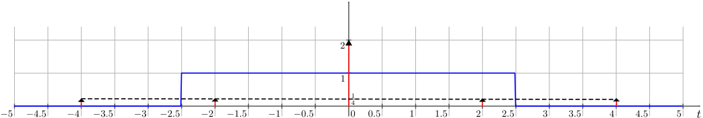
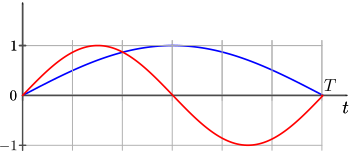

#

## 1번

터보 코드는 콘볼루셔널 부호화기 두 개를 인터리버를 사용하여 병렬 연접한 것이지만 아주 긴 블록 부호로 간주된다고 한다. 그러나 콘볼루셔널 부호화기를 쓰기 때문에 길쌈 부호의 특징도 갖는다고 하니 $1$번 보기가 좀 애매하다고 생각한다.(난 정보이론 잘 모른다)
그러나 터보 코드는 오류 정정을 하는 FEC 방식의 일종이지, 오류가 난 데이터의 재전송을 요청하는 ARQ가 아니다. ARQ는 채널 용량과 관계도 없을 것 같다.

따라서 답은 **2번**이다.

## 2번

1. $x(t)$가 샘플링된 신호라면 $X(f)$가 주기 신호일 것이다. 샘플링된 신호는 연속 신호가 아니라 오히려 불연속 신호이다.
2. $x(t)$가 주기 신호이면 기저 주파수의 배수 주파수 성분들만 갖게 되므로 $X(f)$가 이산 신호가 될 것이다. 반대로 $x(t)$가 비주기 신호라면 무수히 많은 주파수 성분들이 있어야 표현이 가능할 것이므로 $X(f)$는 연속 신호가 될 것이다.
3. $x(t)$가 실수이고 기함수이면 $x(t)$를 이루는 삼각함수는 기함수인 sin밖에 없을 것이다.
   그런데 sin을 주파수 영역에서 표현하면 어떻게 되는가? $e^{j2\pi ft}=cos(2\pi ft)+jsin(2\pi ft)$이므로 $sin(2\pi ft)=\frac{1}{2j}\left(e^{j2\pi ft}-e^{-j2\pi ft}\right)$이니 주파수 영역에서 허수이고 기함수로 표현된다.
4. $x(t)$가 실수이고 우함수이면 $x(t)$를 이루는 삼각함수는 우함수인 cos밖에 없을 것이다. 그리고 $cos(2\pi ft)=\frac{1}{2}\left(e^{j2\pi ft}+e^{-j2\pi ft}\right)$이므로 cos는 실수이고 우함수로 표현된다.

따라서 답은 **4번**이다.

## 3번

메시지 신호는 $5sin(20\pi t)$이므로 메시지의 대역폭 $f_m=10 \text{ Hz}$이다. 그리고 변조된 신호의 주파수로부터 최대 주파수 변이 $m_f$을 구하기 위해 cos의 인자를 미분하면

$$
\omega=200\pi+100\pi cos(20\pi t)\Rightarrow m_f=\frac{100\pi}{2\pi}=50 \text{ Hz}
$$

이므로 카슨의 법칙을 이용해 대역폭을 구하면

$$
B=2(f_m+m_f)=2(10+50)=2\times60=120\text{ Hz}
$$

이다. 따라서 답은 **1번**이다.

## 4번

에일리어싱은 나이퀴스트 주파수보다 느리게 샘플링할 경우 발생하므로 답은 **2번**이다.

## 5번

1. DSB-SC는 메시지 신호에 반송파를 그냥 곱하는 것이므로 메시지 신호의 스펙트럼을 반송파 주파수만큼 이동시킨다.
2. 옳다.
3. 스펙트럼에서 반송파 주파수 위치에서 임펄스 형태가 나타난다는 것은 그 위치에 반송파로만 이루어진 신호가 있다는 뜻이므로 DSB-FC(=DSB-LC)에 해당한다. 따라서 옳지 않다.
4. 옳다.

따라서 답은 **3번**이다.

## 6번

확률변수의 특성함수 $\Phi_X(\omega)$는 다음과 같다.

$$
\Phi_X(\omega)=E\left[e^{j\omega x}\right]=\int_{-\infty}^{\infty}e^{j\omega x}f_X(x)dx
$$

위 식을 보면 결국 특성함수는 확률밀도함수의 푸리에 변환임을 알 수 있다.

주어진 확률밀도함수로부터 특성함수를 구하면

$$
\Phi_X(\omega)=\int_{0}^{2}\frac{1}{2}e^{j\omega x}dx=\frac{1}{j2\omega}\left(e^{j2\omega}-1\right)
$$

따라서 답은 **3번**이다.

## 7번

$(7,4)$ 해밍 코드는 총 $7$비트를 사용하고 그중 $4$비트가 메시지, $3$비트가 패리티 비트이다. 또한 해밍 코드는 최소 해밍 거리가 $3$인 코드이다.
따라서 $1$비트의 오류는 정정할 수 있다. 하지만 $2$비트의 오류가 발생한다면, 원래 코드와의 거리는 $2$인데 다른 어떤 코드와의 거리가 $3-2=1$일 수도 있으므로 잘못 판정될 수 있다.
이로부터 교차확률(한 비트를 보냈을 때 수신측에서 반전된 비트를 받을 확률)이 $p$인 이진대칭채널에서 부호어 오류 확률은 $(\text{총 확률 }1)-(\text{모든 비트가 정확히 전송될 확률})-(\text{어느 한 비트가 오류일 확률})$이므로

$$
1-(1-p)^7-\binom{7}{1}p(1-p)^6=1-(1-p)^7-7p(1-p)^6
$$

이므로 답은 **4번**이다.

## 8번

$y(t)$를 $x(t)$로 표현하면

$$
y(t)=x(2t)+x\left(\frac{t}{2}\right)
$$

이다.

한편 $X(f)=2sinc(2f)$라고 주어졌으므로(직접 구해보자) $x(at)$의 푸리에 변환을 이를 이용해서 표현하는 방법을 생각해보자.
먼저 $t$ 앞에 계수 $a$가 붙었다는 것은 시간이 $\frac{1}{a}$배로 느리게 흘렀을 때 원래 신호와 같은 값을 갖는다는 것을 의미한다.
시간이 이렇게 느리게 흐른다면 결국 주파수는 $a$배가 되어서 보상해주어야 할 것이다. 그러려면 어떻게 되어야 하는가? $t$ 앞에 $a$가 붙은 것과 반대로 $f$ 앞에 $\frac{1}{a}$가 붙어야 $a$배로 커진 주파수가 들어갔을 때 동일한 값을 갖지 않겠는가?
즉

$$
\mathcal{F}\{x(at)\}=kX\left(\frac{1}{a}f\right)
$$

이다.

위에서 $k$가 곱해진 것을 보라. 왜 필요할까? 바로 Parseval's Theorm을 만족해야 하기 때문이다. 원래 신호에서는 $x(t)$의 에너지(또는 전력)와 $X(f)$의 에너지(또는 전력)이 같았다.
한편 $x(at)$의 에너지 또는 전력은 $x(t)$ 대비 어떻게 될까? 시간이 $\frac{1}{a}$배 느리게 흘렀을 때 원래 신호와 같은 값을 갖는다고 했으니, 그래프의 폭이 $\frac{1}{a}$배 되는 것과 같고, 결국 적분으로써 구해지는 넓이도 $\frac{1}{a}$배가 된다. 즉 에너지 또는 전력이 $\frac{1}{a}$가 된다는 것이다.
그런데 $X(\frac{1}{a}f)$는 어떤가? 반대로 그래프가 $a$배로 넓게 퍼지는 것이니, 에너지 또는 전력이 $a$배가 되지 않겠는가? 결국

$$
\mathcal{F}\{x(at)\}=\frac{1}{a}X\left(\frac{1}{a}f\right)
$$

가 되어야 $\frac{1}{a^2}\cdot a=\frac{1}{a}$가 되어 좌변과 같아진다.(사실 $a$의 부호로 인해 달라지는 게 있겠지만 그건 각자 잘 생각해보자.)

치환적분을 해서 정석적으로 푸는 방법도 있겠지만 그런 계산에 약해서 다른 방법을 소개해 보았다.

아무튼 이를 이용해서 주어진 문제를 해결하면

$$
\mathcal{F}\{y(t)\}=\mathcal{F}\left\{x(2t)+x\left(\frac{t}{2}\right)\right\}=\frac{1}{2}X\left(\frac{1}{2}f\right)+2X(2f)=sinc(f)+4sinc(4f)
$$

이므로 답은 **1번**이다.

## 9번

5개 중 동시에 3개를 한꺼번에 선택하는 경우의 수는

$$
\binom{5}{3}=\frac{5!}{2!3!}=10
$$

이다. 이 경우 중 불량품이 하나도 없을 경우의 수는 $3$개 모두 정상품일 경우 하나 뿐이다. 따라서 불량품이 적어도 하나 이상 포함되는 경우의 수는 $10-1=9$이다. 그러므로 구하는 확률은

$$
\frac{9}{10}
$$

이므로 답은 **4번**이다.

## 10번

1. FM은 중첩의 원리가 적용되지 않아서 비선형 변조이다. (PM도 마찬가지로 비선형 변조이다.) AM의 경우 애매함이 있지만, AM$=$DSB-SC라고 생각하면 중첩의 원리가 적용된다.
2. FM 파형을 푸리에 변환하면 베셀 함수로 표현되는 실수 전 구간에 대한 무한히 많은 측파대 주파수 범위를 갖는다. 카슨의 법칙은 이를 충분히 유효한 만큼 잘라서 근사하는 것이다.
3. PM과 FM은 반송파의 진폭에 아무 변화를 주지 않는다. 주파수에만 영향을 준다.
4. 광대역 PM과 광대역 FM은 대역폭이 넓은 만큼 같은 대역폭의 잡음이 가해져도 AM보다 영향이 상대적으로 적다.

따라서 답은 **1번**이다.

## 11번

반송파의 진폭 변화는 $2.8-1.6=1.2$이다. 그리고 원래 반송파 진폭은 $1.6$이므로 메시지에 의해 진폭이 변한 정도(비율)을 구하면

$$
a=\frac{1.2}{1.6}=\frac{3}{4}=0.75
$$

이므로 답은 **2번**이다.

## 12번

$8$-PSK 변조를 하면 심볼당 $log_2 8=3$비트를 담게 되므로 심볼률은 비트율의 $\frac{1}{3}$배이다. 비트율이 $10$ kbps이므로 심볼률은 $\frac{10}{3}$ ksymbols/s이다.
심볼 지속시간 $T_s$은 이의 역수이므로

$$
T_s=\frac{1}{\frac{10}{3}\times 10^3}=3\times10^{-4}=0.3\text { ms}
$$

이므로 답은 **3번**이다.

## 13번

1. 다른 사용자의 신호를 넓은 주파수 대역으로 확산시켜서 전력이 무시 가능한 잡음 수준으로 낮아져서 무시가 가능하게 하는 게 DSSS이다.
2. 다른 사용자가 너무 가까워버리면 워낙 수신되는 전력이 크므로 넓은 주파수 대역으로 확산시켜도 전력이 충분히 작아지지 않고 오히려 실사용자보다 더 큰 영향의 신호가 될 수 있는데 이를 근원문제라고 한다.
3. 수신기 간 직교성을 가진 확신 부호 또는 의사잡음을 사용함으로써 다른 코드를 사용하는 사용자의 신호와 내적했을 때 $0$에 가까운 아주 작은 값이 되게 하고 그 부호에 해당하는 사용자의 신호를 살림으로써 사용자를 구분한다.
4. 정해진 패턴에 따라 불연속적으로 반송파 주파수가 천이하는 것은 주파수 도약(Frequency Hopping) 방식의 대역확산 방식이다.

따라서 답은 **4번**이다.

## 14번

주어진 조건을 이용해서 계산하면

$$
P\left[1 \lt X \lt 3 \right]=\int_ 1 ^3 \frac{\beta}{2}e^{-\beta|x|}dx=\frac{\beta}{2}\frac{1}{-\beta}\left[e^{-\beta|x|}\right]_1 ^3=-\frac{\beta}{2}\frac{1}{\beta}\left(e^{-3\beta}-e^{-\beta}\right)
$$

이므로 답은 **4번**이다.

## 15번

사건 $A$와 $B$가 독립이라는 것은 각 사건이 일어나는 정도는 다른 사건이 일어나든 말든 아무 상관이 없다는 것이다.

1. 즉 $B$가 일어났을 때 $A$가 일어날 확률인 $P(A|B)$는 $P(A)$와 다를 바가 없다.
2. $P(A)$라는 것은 사실 전체 사건 중 $A$가 일어나는 정도, 즉 $P(A|U)$와 같다. 주어진 조건부 확률은 전체 사건집합이 $B$로 줄어들었을 때 그 안에서 $A$에 해당하는 원소의 비율을 의미하므로
   $$
   P(A|B)=\frac{P(A\bigcap B)}{P(B)}
   $$
   이다.
3. 주어진 것이 $P(A|B)$와 같으려면 $P(A)=P(B)$여야 한다는 것인데 이는 독립과는 상관이 없는 조건이다.
4. 주어진 것을 분석해보면 분모는 $A$가 일어났을 때의 $B$가 일어날 확률과 $A$가 일어나지 않았을 때 $B$가 일어날 확률, 즉 그냥 $B$가 일어날 확률 $P(B)$이다.(직접 식을 전개해보면 알 수 있다.) 한편 분자는 $P(A)P(B|A)=P(A)P(B)$이므로 $P(B)$가 약분되어 남는 것은 $P(A)=P(A|B)$이다.

따라서 답은 **3번**이다.

## 16번

WSS 전력 신호 $x(t)$의 자기상관함수 $R(\tau)$는

$$
R(\tau)=\lim_{T\to\infty} \frac{1}{T} \int _{-\frac{T}{2}} ^{\frac{T}{2}} x(t)x(t+\tau) dt
$$

이다.

한편 $x(t)$의 평균 전력 $P_a$은

$$
P_a=\lim_{T\to\infty}  \frac{1}{T} \int _{-\frac{T}{2}} ^{\frac{T}{2}} x^2(t) dt
$$

이므로 $R(\tau)$와 비교해보면

$$
R(0)=\lim_{T\to\infty}  \frac{1}{T} \int _{-\frac{T}{2}} ^{\frac{T}{2}} x^2(t) dt=P_a
$$

임을 알 수 있다.

따라서 주어진 신호의 평균 전력은

$$
R(0)=10e^0=10
$$

이므로 답은 **2번**이다.

## 17번

$H(f)$와 $X(f)$를 그래프로 그려보면 다음과 같다.(크기만 그린 그림이다.)

따라서 $Y(f)=H(f)X(f)$는 파란 직사각형 함수 내의 $2\delta(f)$와 $\mathcal{F}\{\frac{1}{2}cos(4\pi t)\}$의 합으로만 구성된다.

한편 전력 스펙트럼은

$$
Y^2(f)=H^2(f)X^2(f)
$$

이다.

주어진 조건에서 출력되는 신호는 $2$와 $\frac{1}{2}cos(4\pi t)$이고, 이들에 곱해지는 크기는 $1$이다. 따라서 출력 신호의 평균 전력은

$$
2^2+\frac{1}{2^2}\cdot\frac{1}{2}=4+\frac{1}{8}=\frac{33}{8}
$$

이므로 답은 **3번**이다.

## 18번

1. 순환 전치(CP)는 자기심볼간섭 ISI(Inter-Symbol Interference)를 줄이기 위해 사용된다. 이를 사용하게 되면 위상만 틀어진 동일 신호가 들어오기 때문에 처리가 어렵지 않다. 열잡은은 말 그대로 열로 인한 잡음이라 온도를 낮춰야만 줄일 수 있다.
2. OFDM은 주파수의 직교성을 이용하므로 주파수의 틀어짐(주파수 편차, 잡음에 의한 위상 변화)에 취약하다.
3. 직교하는 부반송파들을 이용하므로 스펙트럼이 겹쳐도 된다. 왜냐면 특정 부반송파 지점에서 다른 부반송파들에 의한 값이 $0$이 되기 때문이다.
4. 주파수 선택적 페이딩이 발생하더라도 적은 수의 부반송파만 영향을 받으므로 그 적은 수의 부반송파들만 등화하면 되기 때문에 등화기가 간단하다.

따라서 답은 **1번**이다.

## 19번

평균 비트에너지가 동일할 때, 동기 BPSK와 QPSK는 같은 비트오류확률을 갖는다. QPSK의 두 축은 서로 영향을 주지 않기 때문에 독립적인 비트들이다. MSK는 OQPSK의 한 방법이다.
그리고 BPSK, QPSK, MSK는 모두 한 비트 자리의 $0$과 $1$의 각도 차이가 $180\deg$이다. 하지만 BFSK의 경우 $\frac{\pi}{2}$이므로 $\frac{1}{\sqrt{2}}$배가 되어 더 가깝고, 이는 구분이 더 힘들어지니까 당연히 비트오류확률을 높인다.
따라서 답은 **4번**이다.

## 20번

상승 코사인 필터는 롤오프 계수 $\alpha$에 대해 이상적인 직사각형 필터의 경계가 되는 $\pm \frac{1}{2T_s}$지점을 기준으로 $\frac{\alpha}{2T_s}$만큼 더 넓히고 대신 직사각형의 꼭지점을 부드럽게 만든 필터이다.
주어진 조건에서 $\alpha=0.5$이므로 상승 코사인 필터의 끝은

$$
\pm \frac{1+\alpha}{2T_s}=\pm\frac{1.5}{2T_s}
$$

이다.

주어진 조건에서 이진 데이터를 그대로 보내므로 비트율 $T_b=\frac{1}{28 \times 10^3}\text{ s}$=심볼률이고, 따라서 위 필터의 끝이 $\frac{1}{2T_b}$이면 된다. 이를 풀면

$$
\frac{1.5}{2T_s}=\frac{1}{2T_b} \Rightarrow 3T_s=2T_b \Rightarrow T_s=\frac{2}{3}T_b \Rightarrow B=\frac{1}{2T_s}=\frac{3}{4}T_b=21 \text{ kbps}
$$

이므로 답은 **2번**이다.

## 21번

1. 안쪽 점 $4$개의 거리는 (가),(나) 모두 동일하나 (나)의 바깥쪽 점 $4$개는 (가)의 바깥쪽 점 $4$개보다 가까우므로 평균 전송 에너지는 (나)가 더 작다.
2. $1$번에서 설명한 바에 따라 옳다.
3. 비트오류확률은 비교하는 점 간의 거리가 멀수록 낮은데, 평균 전송 에너지가 더 크다고 할지라도 비트 차이가 발생하는 두 점의 거리가 무조건 더 작다고 할 수 없다. 성상도에 따라 달라질 수 있다.
4. $1$번에서 설명한 바에 따라 틀렸다.

따라서 답은 **2번**이다.

## 22번

1. 랜덤 변수의 엔트로피가 최대가 되는 경우는 확률이 균일할 경우이다. 그 경우에는 정말로 어느 게 나올 가능성이 더 높은지 낮은지 예측이 전혀 불가능하기 때문이다. 주어진 경우는 확률이 당연히 균일하지 않다.
2. $X$와 $Y$의 확률분포가 같으므로 $H(X)$만 구해보자.
   $$
   H(X)=E\left[log_2\frac{1}{Pr[X]}\right]=\sum_{k}Pr[X=k]log_2\frac{1}{Pr[X=k]}
   $$
   $$
   =1\times\frac{1}{2}+2\times\frac{1}{4}+3\times\frac{1}{8}+4\times\frac{1}{16}+5\times\frac{1}{32}+5\times\frac{1}{32}=\frac{31}{16}
   $$
   이므로 옳다.
3. $H(X,Y)$는 $X$와 $Y$ 동시의 엔트로피인데, $X$와 $Y$는 독립이라 서로 영향을 주지 않으므로 각각에 대한 엔트로피의 합과 같을 것이다.
4. $H(X|Y)$는 $Y$를 알고 있을 때 $X$에 대한 엔트로피인데, $Y$가 어떻든 $X$에는 독립이라 영향을 주지 못하므로 그냥 $X$에 대한 엔트로피와 같을 것이다.

따라서 답은 **2번**이다.

## 23번

1. 안될 것 없어 보인다. 자기상관 값이 $0$보다 크면서 동일하고, 상호상관이 $0$에 동일하게 가까우면 되는 것이다.
2. 그렇다. 그렇지 않으면 상호상관값이 $0$에 가깝게 작아져서 수신되는 신호의 전력이 작아져서 무시될 것이다.
3. 그렇다.
4. 그렇다. 코드만 다른 것이다.

따라서 답은 **1번**이다.

## 24번

두 반송파가 서로 간섭하지 않는다는 것은 둘을 곱해서 한 심볼구간동안 적분했을 때 $0$이 나온다는 것이다. 그러면 원하는 주파수에 대한 심볼만 꺼낼 수 있을 것이다.
다음 그래프를 보자.

파란색은 주파수가 $\frac{1}{2T}$인 사인파이고 빨간색은 $\frac{1}{T}$인 사인파이다. 대칭성에 의해서 이 둘을 곱해서 적분하면 $0$이 될 것이다. 따라서 이 둘은 서로 간섭하지 않는다.
그러므로 최소 주파수 간격은

$$
\left|\frac{1}{2T}-\frac{1}{T}\right|=\frac{1}{2T}
$$

이므로 답은 **4번**이다.

## 25번

허프만 코딩을 직접 해 보자.

이로부터 평균 비트 수를 구하면

$$
H=1\times\frac{3}{5}+2\times\frac{3}{10}+3\times\frac{2}{25}+3\times\frac{1}{50}=\frac{75}{50}=1.5 \text{ b}
$$

이므로 답은 **1번**이다.
