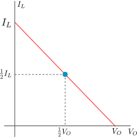
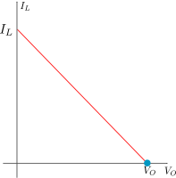

#

## 1번

$1000$ kHz를 중심으로 하여 좌우로 $[1,10]$ kHz의 주파수 성분들이 옮겨간 것이므로 변조된 출력 주파수의 범위는 $[1000-10,1000-1]=[990,999]$ kHz 대역 및 $[1000+1,1000+10]=[1001,1010]$ kHz 대역이다.
따라서 **3번** 주파수는 나타날 수 없다.

## 2번

먼저 아날로그 신호에 대해 시간 측면에서 이산적으로 표본화(샘플링한다). 이렇게 나온 이산 신호의 값은 매 시간에서 아날로그 값을 가지므로 한정된 비트 수로 표현할 수 있는 양자화를 하여 디지털 신호를 생성한다.
이렇게 나온 디지털 신호는 한 비트 이상의 PCM 신호인데, 마지막 단계인 부호화에서 이 비트들을 어떻게 담고 표현할 것인지 결정한다. 따라서 답은 **3번** 이다.

## 3번

주파수가 너무 낮다면 $\text{C}_1$ 커패시터가 신호 전달을 막을 것이므로 $\text{R}_1$과 $\text{C}_1$이 고역 통과 필터를 구성한다. 하지만 주파수가 너무 높다면 신호는 $\text{C}_2$를 통해서 빠져나가버릴 것이므로 $\text{R}_4$와 $\text{C}_4$는 저역 통과 필터를 구성한다.
(왜 $\text{R}_2,\text{R}_3$은 언급하지 않았을까?)

이 둘을 합성하면 주어진 것과 같이 중간 신호만 잘 통과할 수 있는 밴드 패스 필터가 만들어진다.

저역 통과 필터이건 고역 통과 필터이건 컷오프 주파수는 다음과 같다.

$$
f_c=\frac{1}{2\pi RC}
$$

주어진 조건에서 낮은 쪽 컷오프 주파수 $f_{c,l}=\frac{1}{2\pi}$ kHz, 높은 쪽 주파수 $f_{c,h}=\frac{1}{\pi}$ kHz로 주어져 있으므로

$$
\begin{gather}
   f_{c,l}=\frac{1}{2\pi}\times 10^3=\frac{1}{2\pi \times 10^3 \times \text{C}_1} \\
   \Rightarrow \text{C}_1=1 \text{ }\mu\text{F}\\
   f_{c,h}=\frac{1}{\pi}\times 10^3=\frac{1}{2\pi \times 10^3 \times \text{C}_1} \\
   \Rightarrow \text{C}_2=0.5\text{ }\mu\text{F}
   \end{gather}
$$

이므로 답은 **2번** 이다.

## 4번

주기는

$$
\begin{equation}
   \begin{split}
      T&=\frac{2\pi}{\omega}\\
      &=\frac{2\pi}{2\pi\times 60}\\
      &=\frac{1}{60} \text{ s}
   \end{split}
\end{equation}
$$

이다.

직류 부하 전압 $V_{R_L}$은 한 주기 동안의 평균 전압인데, 반주기동안만 다이오드가 켜지므로 적분 구간은 반주기여야 한다. 따라서

$$
\begin{equation}
   \begin{split}
      V_{R_L}&=\frac{1}{\frac{1}{60}}\int _0 ^{\frac{1}{120}} 100\pi sin(2\pi\times 60t)dt\\
      &=60\times 100\pi\times \frac{1}{120\pi}[-cos(2\pi\times 60t)]_0^{\frac{1}{120}}\\
      &=50\times 2=100\text{ V}
   \end{split}
\end{equation}
$$

이다. 따라서 답은 **1번**이다.

$$
\begin{equation}
   \begin{split}
      I_{R_L}&=\frac{V_{R_L}}{R_L}\\
      &=5\text{ I}
   \end{split}
\end{equation}
$$

임도 쉽게 알 수 있다.

## 5번

1. 진폭 변조 방식은 대역폭이 좁아서 그 부분에 잡음이 있으면 많은 악영향을 받으나 FM은 영향의 상대적인 크기가 더 작아 잡음 성능이 향상된다.
2. FM은 넓은 대역폭을 쓰는 특성상 반송파 주파수가 높아야 한다.(안 그러면 주파수 스펙트럼에서 음의 주파수와 양의 주파수가 겹치는 부분이 나타날 것이다.) 따라서 높은 주파수를 쓰는 VHF 통신에 적합하다.
3. 변조된 신호의 전력은 메시지 신호와 관계가 없다. 정확히는 FM의 주파수 스펙트럼을 구했을 때 베셀 함수로 나타나는데, 이 함수의 특성상 메시지와는 무관한 제곱의 적분값이 나온다. 결과적으로는 진폭이 일정하므로 전력이 일정하다라고 생각할 수 있다.
4. FM의 정의 그대로이다.

따라서 답은 **3번**이다.

## 6번

1. A급 전력증폭기는 동작점이 교류부하선의 중앙에 위치한다.

   
   동작점에서의 전력은

   $$
   \begin{equation}
      \begin{split}
         P_b&=\frac{1}{2}V_O\times\frac{1}{2}I_L\\
         &=\frac{1}{4}V_O I_L
      \end{split}
   \end{equation}
   $$

   이다.

   한편 최대로 전력증폭시 $V_O$가 $0\rightarrow V_O$로 움직일 때 $I_L$은 $I_L\rightarrow 0$으로 움직인다.
   그러므로 이렇게 최대로 전력증폭될 때 증폭되는 전력은 주어진 그래프의 넓이이므로

   $$
   P_a=\frac{1}{2}V_O I_L
   $$

   이 된다.

   따라서 최대 전력 효율은

   $$
   \begin{equation}
      \begin{split}
         \eta&=\frac{P_a}{P_b}\\
         &=\frac{\frac{1}{2}V_O I_L}{\frac{1}{4}V_O I_L}\\
         &=\frac{1}{2}
      \end{split}
   \end{equation}
   $$

   이 되므로 최대 효율은 $50$%이다.

2. B급 전력증폭기는 동작점이 차단점에 있다.

   
   따라서 반주기 동안에는 전압이 차단점 왼쪽 구간에서 움직이므로 전류도 주어진 빨간 부하선을 따라 나타나지만 나머지 반주기 동안에는 전압이 차단점 오른쪽에 위치하므로 전류는 나타날 수 없다. 그러므로 전류는 최대 반주기 시간동안만 흐를 수 있다.

   효율은 어떨까? 출력이 있는 반 주기동안의 최대 직류 전류를 구해보자.

   $$
   \begin{equation}
      \begin{split}
         I_b&=\frac{1}{2\pi}\int _0 ^ {\pi} I_L sin \theta d\theta\\
         &=\frac{I_L}{\pi}
      \end{split}
   \end{equation}
   $$

   이다. 이 때 전체적인 전압은 전압은 $V_O$로 유지된다. 따라서 최대 직류 전력은

   $$
   \begin{equation}
      \begin{split}
         P_b&=V_bI_b\\
         &=\frac{V_OI_L}{\pi}
      \end{split}
   \end{equation}
   $$

   이다. 다음으로 최대 교류 전력의 실효값 $P_a$를 구하면

   $$
   \begin{equation}
      \begin{split}
         P_a&=\frac{1}{2\pi}\int_0 ^{\pi}V_OI_L sin^2 \theta d\theta\\
         &=\frac{1}{2\pi}\times V_OI_L\times \int_0 ^{\pi} \left(\frac{1}{2}-2cos2\theta\right)d\theta\\
         &=\frac{V_OI_L}{4}
      \end{split}
   \end{equation}
   $$

   따라서 최대 전력 효율은

   $$
   \begin{equation}
      \begin{split}
         \eta&=\frac{P_a}{P_b}\\
         &=\frac{\frac{V_oI_L}{4}}{\frac{V_oI_L}{\pi}}\\
         &=\frac{\pi}{4}\\
         &\approx 0.785
      \end{split}
   \end{equation}
   $$

   즉 약 $78.5$%이다.

3. C급 전력증폭기는 동작점이 위 그래프의 제 4사분면에 존재한다. 즉 차단점 이하에 동작점이 있어서 전체 주기 중 짧은 일부 시간 동안만 전류가 흐른다. 아래 그림에서 가로 점선 높이까지가 흐르는 전류 크기의 범위이다.

   

   따라서 낮은 전류로 인해 소비전력도 적으므로 효율이 $100$%에 근접한다.

4. B급 푸시풀 전력증폭기의 경우, 트랜지스터가 켜지려면 BJT의 경우 $0.7$ V, MOS의 경우 문턱 전압 이상의 전압이 공급되어야 정상 작동 범위에 들어간다. 따라서 그 전까지는 꺼지고 켜지는 구간 사이에서 교차일그러짐이 발생한다.
   AB급 전력증폭기는 이를 해결하기 위해서 A급과 B급 중간에 동작점을 두어서 전력 효율을 A급보다 올리면서 교차일그러짐을 줄인 전력증폭기이다.

따라서 답은 **4번** 이다.
