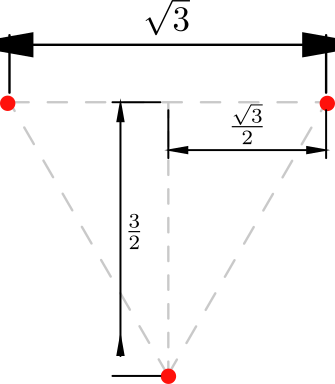

#

## 1번

주어진 조건에서 $l=0.5 \text{ m}$, $N=400\Rightarrow n=N/l=800$, $\mu_r = 2000$, $I=10 \text{ A}$이다.
그리고

$$
B=\mu_0 \mu_r H
$$

이며 맥스웰 방정식에서

$$
\begin{gather}
   \nabla \times \vec{H}=\vec{J} \\
   \Rightarrow \oint_C \vec{H} \cdot d\vec{l}=\iint_C \vec{J} \cdot d\vec{s}
\end{gather}
$$

이다.

한펀 주어진 것과 같은 길이가 철심 반지름에 비해 매우 긴 솔레노이드에서 솔레노이드 내부와 외부를 포함하는 폐곡선을 솔레노이드 길이 방향으로 길게 만들면 그 폐곡선을 따라 회전하는 성분은 솔레노이드 내부의 길이 방향 $\vec{H}$밖에 없다.
아래 그림을 참고하라. 까만 색의 폐곡선에서 $\Delta y \rightarrow 0$인 상황이므로 이때 수평 성분은 적분에 기여할 수 없고, $l$과 평행한 성분만 적분에서 계산된다.

$$
\begin{equation}
   \begin{split}
      Hl&=nlI \\
      \Rightarrow H&=nI\\
      &=800 \cdot 10=8000
   \end{split}
\end{equation}
$$

이므로

$$
\begin{equation}
   \begin{split}
      B&= \mu_0 \mu_r H \\
      &= 4\pi \times 10^{-7} \cdot 2000 \cdot 8000\\
      &=64\pi\times 10^{a} \text{ 단, }a\text{는 어떤 정수}
   \end{split}
\end{equation}
$$

이므로 답은 **4번**이다.

## 2번

무한 면전하들이 $yz$평면에 평행하게 놓여 있다면 전계는 $\vec{a_x}$ 방향으로 생긴다.

또한 무한 면전하들은 단위면적당 전하밀도만큼의 전기력선을 만들어서 내보내는데, 양쪽으로 균일하게 전기력선이 방사되므로 한 면당 전하밀도의 절반의 전기력선이 방사된다.

(주의: 아래의 세 그림에서의 화살표는 전계가 아니라 전기력선이다. 그리고 화살표의 길이는 전계의 세기 등을 의미하지 않으며, 그냥 쭉 뻗어나가는 전기력선 하나라고 생각하라.)

만약 서로 다른 극성의 두 무한 면전하가 평행하게 존재한다면 다음과 같이 될 것이다.

반대로, 같은 극성의 두 무한 면전하가 평행하게 존재한다면 다음과 같게 될 것이다.

한편 전기력선이 존재하는 영역에서는 출발한 전기력선들이 계속 평행하게 쭉 진행하므로 중간에 전기력선들의 간격이 촘촘해진다거나 넓어지지 않는다. 즉 밀도가 일정하므로, 전기력선의 밀도인 전계의 세기가 일정하다.

그러므로 1번 점전하는 $-1.5$, 2번 점전하는 $2$, 3번 점전하는 $-2$의 전계를 만들어내므로

$$
\begin{equation}
   \begin{split}
      \vec{E}&=\frac{\vec{D}}{\varepsilon _0} \\
      &=(-1.5+2-2)\vec{a_x}\cdot \frac{10^{k}}{\varepsilon _0}\\
      &=-\vec{a_x}54\pi \times 10^k \text{ (단, }k\text{는 어떤 정수)}
   \end{split}
\end{equation}
$$

이므로 답은 **1번**이다.

## 3번

완전한 원의 경우 반지름이 $r$이고 전류 $I$가 흐르는 원의 중심에서의 자계 크기는

$$
H = \frac{I} {2r}
$$

이다. 그러므로 반원의 경우에는 이의 절반만 자계를 만들어낼 것이므로

$$
\begin{equation}
   \begin{split}
      H&=\frac{I}{4r}=\frac{10}{4} \cdot 10^{a}\\
      &=\frac{1}{4}
   \end{split}
\end{equation}
$$

(단, $a$는 어떤 정수)이므로 답은 **2번**이다.

## 4번

자유공간의 고유임피던스 $\eta_0=120\pi$로 실수이므로 자계 $\vec{H}$는 전계 $\vec{E}$에 수직이다.
따라서 $\vec{H}$에는 $\vec{a_y}$방향 성분이 없어야 한다.
또한

$$
H=\frac{E}{\eta}=\frac{E}{\eta_0}
$$

이므로 전계와 자계의 위상은 같다. 따라서 답이 될 수 있는 것은 **2번** 뿐이다.

검증을 위해 먼저 주어진 조건에서 전계가 $+\vec{a_z}$ 방향으로 진행하는 것을 생각하자.
그러면 포인팅 벡터

$$
\vec{S}=\vec{E}\times\vec{H}
$$

는 $+\vec{a_z}$ 방향 성분만을 가져야 한다.
따라서

$$
\vec{a_y}\times(-\vec{a_x})=+\vec{a_z}
$$

이므로 역시 $-\vec{a_x}$을 계수로 갖는 **2번**이 답임을 알 수 있다.

## 5번

$$
\begin{equation}
   \begin{split}
      \Phi&=\iint_S \vec{B}\cdot d\vec{S}\\
      &=\iint_{0\le y \le 1, 1\le z\le 4}\vec{B}(x=3)\cdot d\vec{a_x}\\
      &=\iint_{0\le y \le 1, 1\le z\le 4}y^2 dy\\
      &=3\cdot \left[ \frac{y^3}{3}\right] ^1 _0\\
      & = 1
   \end{split}
\end{equation}
$$

이므로 답은 **1번**이다.

## 6번

1. 스넬의 법칙을 굴절률 $n$을 이용하여 식으로 표현하면
   $$
   n_1 sin \theta_i = n_2 sin \theta_t
   $$
   이다. 한편 어떤 매질에서 빛의 속력
   $$
   v=\frac{1}{\sqrt{\mu\varepsilon}}=\frac{1}{\sqrt{\mu_0\mu_r\varepsilon_0\varepsilon_r}}
   $$
   은 진공에서의 속력 $c=\frac{1}{\sqrt{\mu_0\varepsilon_0}}$을 굴절률만큼 나눈 것과 같다. 즉
   $$
   v=\frac{c}{n}
   $$
   이다. 따라서 굴절률 $n$은 다음과 같이 정리된다.
   $$
   \begin{equation}
      \begin{split}
         n&=\frac{c}{v}\\
         &=\frac{\frac{1}{\sqrt{\mu _0\varepsilon _0}}}{\frac{1}{\sqrt{\mu _0\mu _r\varepsilon _0\varepsilon _r}}}\\
         &=\sqrt{\mu _r \varepsilon _r}
      \end{split}
   \end{equation}
   $$
   이를 스넬의 법칙 식에 대입하면
   $$
   \begin{gather}
      \sqrt{\mu_r\varepsilon_1}sin \theta_i=\sqrt{\mu_r\varepsilon_2}sin \theta_t\\
      \Rightarrow \frac{sin\theta_t}{sin\theta_i}=\sqrt{\frac{\varepsilon_1}{\varepsilon_2}}
   \end{gather}
   $$
   이다.
2. 입사각과 굴절각은 경계면에 수직인 법선을 기준으로 한다.
3. 스넬의 법칙은 매질의 굴절률과 입사각에만 관련있으므로 편파 특성과 무관하다.
4. 임계각을 넘어서는 입사각에서는 모든 전자기파가 반사되어 버리지만 이보다 작은 입사각에서는 투과되는 성분이 있다.
   따라서 답은 **4번**이다.

## 7번

전송선로에서 어떤 지점에서 바라본 입력 임피던스 $Z_{in}$은 다음과 같다.

$$
Z_{in}=Z_0\frac{Z_L+jZ_0 tan \beta l}{Z_0+jZ_L tan \beta l}
$$

위 식을 조금이라도 쉽게 외워 보자.

일단 $\text{(임피던스)}+j\text{(임피던스)}tan(\beta\cdot\text{(길이)})$ 형태가 분자와 분모에 똑같이 있고 이 분수에 둘 중 한 임피던스가 곱해지는 형태임은 기억해야 한다.

다음으로, 만약 길이가 $0$일 경우를 생각해 보자. 이 때에는 특성 임피던스가 나타날 길이가 없고 바로 종단 임피던스 $Z_L$이 나타날 것이다.
이 때의 수식은 $\text{(임피던스)}\cdot\frac{\text{(임피던스)}}{\text{(임피던스)}}$인데, 이 값이 종단 임피던스여야 한다. 그리고 분모와 분자에 각각 있는 임피던스는 서로 다른 종류이므로 이 분수는 $1$이 될 수 없다.

따라서 남은 방법은 분수 앞에 곱해지는 임피던스와 분모의 임피던스가 같은 종류라서 약분되어 $1$이 되는 것이고, 분자의 임피던스는 종단 임피던스 $Z_L$이 되어야 한다.
그렇다면 분수 앞에 곱해지는 임피던스와 분모의 임피던스는 특성 임피던스 $Z_0$일 것이다.

마지막으로 탄젠트에 곱해지는 임피던스는 그 앞의 더해지는 임피던스와 같은 종류가 아니어야 한다. 만약 그렇다면 저 분수는 그냥 $Z_0$과 $Z_L$의 비율 값으로 약분되어 버릴 것이다.
이를 정리하면 위 결과가 나온다.

이제 병렬로 연결된 $100\text{ }\Omega$에서 바라본 특성 임피던스 $Z_0$와 종단 저항$Z_L$이 이루는 임피던스 $Z_{in,2}$는 다음과 같다.

$$
\begin{equation}
   \begin{split}
      Z_{in,2}&=50\cdot \frac{100+j50tan \left( \frac{2\pi}{\lambda_g}\cdot\frac{\lambda_g}{2}\right) }{50+j100tan\left( \frac{2\pi}{\lambda_g}\cdot\frac{\lambda_g}{2}\right) }\\
      &=100
   \end{split}
\end{equation}
$$

문제에서 묻는 임피던스 $Z_{in}$은 위의 임피던스와 병렬로 연결되어 있는 $100\text{ }\Omega$와 병렬로 합성된 임피던스이므로

$$
\begin{equation}
   \begin{split}
      Z_{in}&=Z_{in,2}\vert\vert100\\
      &=100\vert\vert100\\
      &=50
   \end{split}
\end{equation}
$$

이다. 따라서 답은 **2번**이다.

## 8번

전자기학에서의 근본 힘인 로렌츠 힘은

$$
\vec{F_l}=q(\vec{E}+\vec{v}\times\vec{B})
$$

이다.

한편 (어떤 단면의) 전류는 단위시간 동안 어떤 단면을 통과하는 전하량이다. 이 전류의 정의로부터 전류를 수식적으로 구해보자.

전하량 $q$을 갖고 있는 전하의 모임들이 여러 개가 있는데, 이 모임들이 이동하는 속력이 $1$이고, 이 모임들은 서로 $1\cdot1=v$(속력 단위시간과 값만 같을 뿐 완전히 다른 물리량이다. 속력 $1$(차원은 거리/시간)에 단위시간 $1$(차원은 시간)이 곱해진 $1$ 거리의 물리량이기 때문이다.)의 간격을 두고 있다고 하자.

그럼 이웃한 두 모임 사이의 어느 단면을 단위시간동안 통과하는 전하량 모임은 $1$개니까 $q$일 것이다.

만약 속력이 $v$가 된다면 단위시간동안 $v$배만큼의 전하량 그룹이 이동할 것이므로 전류는

$$
I=qv
$$

이 된다. 여기서의 $I$는 전하량과 속도의 곱이 전류의 정의와 동일하다는 것을 나타내는, 일반적으로 성립하는 식을 나타낼 뿐임에 유의하라.

이를 로렌츠 힘에 적용해보면 주어진 상황과 같이 전기장이 없는 경우에는 위 식이

$$
\vec{F_l}=q(0+\vec{v}\times\vec{B})=q\vec{v}\times\vec{B}
$$

가 되고, 주어진 상황에서 자기장은 $\pm\vec{a_z}$방향으로 전류 방향인 $\pm\vec{a_y}$와 수직이다.

따라서 위 외적의 크기는 그냥 두 벡터의 크기의 곱이 되므로 로렌츠 힘의 크기는

$$
F_l=qvB=I
$$

이다. 그리고 이 힘은 도선 내의 전하량 그룹 하나가 들어있는 단위 길이마다 작용하므로, 전체 힘은 도선의 길이를 곱해줘야 한다.
반대로 말하면 단위 길이당 로렌츠 힘(=주어진 상황에서는 자기력이다. 전기장이 없으므로 전기력은 없다.)은 지금 구한 $F_l$인 것이다.

한편, 아직 $B$를 안 구했으니 구해보자. 먼저

$$
\vec{B}=\mu\vec{H}
$$

임을 유념하자. 또한 맥스웰 방정식에서

$$
\begin{gather}
   \nabla \times \vec{H}=\vec{J} \\
   \Rightarrow \iint_C \nabla \times \vec{H} \cdot d\vec{s}=\oint_C \vec{H}\cdot d\vec{l}=\iint_C \vec{J}\cdot d\vec{s}=I
\end{gather}
$$

이다. 여기서의 $I$는 위에서의 $I=qv$와는 무관한, 맥스웰 방정식을 이루는 일반적인 전류를 의미한다. 혼란스러울테니 이제 실제 문제를 풀어보자.

먼저, 각 도선과 관련된 물리량들은 아래첨자에 도선 번호를 써서 나타내기로 하겠다.
주어진 문제에서는 도선을 축으로 원형의 대칭성이 있다. 따라서 도선 $1$을 축으로 하는 원을 폐곡선으로 하여 위 맥스웰 방정식의 적분형에 대입하면

$$
\begin{equation}
   \begin{split}
      \oint_C \vec{H_1}\cdot d\vec{l}&=2\pi r H_1\\
      &=I_1
   \end{split}
\end{equation}
$$

이므로

$$
H_1=\frac{I_1}{2\pi r}=\frac{10}{2\pi r}
$$

이다. 이를 이용하면 도선 $1$에서 도선 $2$까지의 거리 $r=0.2$ m에서의 $B_1$는

$$
\begin{equation}
   \begin{split}
      B_1&=\mu H_1\\
      &=\mu_0 H_1\\
      &=4\pi\times 10^{-7}\times \frac{10}{2\pi\cdot 0.2}\\
      &=10^{-5} \text{ Wb/m}^2
   \end{split}
\end{equation}
$$

이다.

따라서 도선 $2$가 받는 단위 길이당 로렌츠 힘(=단위 길이당 자기력) $F_{l,2}$는

$$
\begin{equation}
   \begin{split}
      F_{l,2}&=qvB_1\\
      &=I_2B_1\\
      &=10\times 10^{-5}\\
      &=10^{-4}\text{ F}
         \end{split}
\end{equation}
$$

이고, 방향은 $-\vec{a_x}$이니 답은 **3번**이다.

## 9번

반사 계수의 식은 다음과 같다.

$$
\Gamma=\frac{Z_L-Z_0}{Z_L+Z_0}
$$

이 식의 의미를 잠깐 분석해보자.

어떤 줄을 위아래로 세게 한번 흔들어서 파동을 만들어 진행시키는 상황을 생각해보자.
이 때, 이 줄의 다른 끝이 어떤 점에 단단히 고정되어 있다면 그 지점에서는 당연히 줄이 흔들릴 수 없으니 파동이 없어지는 것처럼 보이다가 튕겨나와서 반대방향으로 반사되어 나올텐데, 형태는 진행파가 뒤집어진 모양이 될 것이다. 즉 $-1$배로 반사된 것이다.
잘 생각하기 어렵다면 $-1$배가 된 파동이 반대방향으로 진행하면서 원래 파동과 더해진다고 생각하자. 그렇다면 고정된 줄 끝에서는 $1-1=0$이므로 흔들릴 수 없는 위 상황이 될 것이다.

완전도체에서의 반사도 이와 똑같다. 완전도체에서는 수평 방향 전계가 $0$인데, 이는 파동이 이 완전도체에서는 사라진다는 것이다. 따라서 반사되는 비율은 $-1$이다.

만약 줄에서 파동을 만드는 상황에서 반대쪽 끝이 어떤 수직 막대에 매여 있지만 위아래로의 움직임은 자유롭다면 어떨까? 막대에 매인 부분이 위로 올라갔다가 다시 내려오면서 어떻게 보면 그 막대 지점에서부터 똑같은 파동이 반대방향으로 만들어져서 진행하는 것과 같은 파동이 나타날 것이다.
즉 진행방향만 다른 똑같은 파동이므로 반사파는 $1$배가 되는 것이다. 전파의 경우에는 임피던스가 무한대인 면에서 수직 입사-반사되는 경우에 대응된다.

만약 파동이 진행하는데 아무 차이도 못 느낀다면, 즉 임피던스가 똑같다면 어떨까? 반사되는 게 없이 계속 직진할 것이니 반사계수는 $0$이 되는 게 당연하다.

그렇다면 반사 계수의 범위는 어떻게 될까? 입사된 파보다 더 커질 수는 없을 터이니 크기는 $1$보다 작거나 같아야 할 것이다.

위의 식은 위 경우들, 즉 $Z_L=0$일 때 반사계수가 $-1$, $Z_L=\infty$일 때 반사계수가 $1$, 그리고 $Z_L=Z_0$일 때 반사계수가 $0$이 되는 것을 보여준다.

또한 반사계수의 범위도 제한하게 되는데, $Z_L-Z_0$는 분모가 아닌 분자에 있어서 분자에 $Z_L+Z_0$가 있을 때 분모가 이 값보다 작아져서 반사계수의 크기가 $1$보다 커지는 경우가 발생하지 않는다.

아무튼, 위 식을 극단적인 상황과 연결해서 생각해보면 각 임피던스가 어느 자리게 가야 하고 어디에 $-$가 오고 $+$가 오는지 조금 더 쉽게 외울 수 있을 것이다.

이제 문제를 풀어보자. 주어진 전계의 식을 관찰하면 지수부에 $-z$가 있으므로 입사파는 $+\vec{a_z}$ 방향으로 이동하고 있다.
한편 완전 도체는 임피던스가 $0$이므로 위 식대로 반사 계수를 구하면

$$
\Gamma=\left.\frac{Z_L-Z_0}{Z_L+Z_0}\right\vert_{Z_L=0}=-1
$$

이다.

따라서 반사파 $E_r$의 계수는 입사파의 계수인 $E_0(\vec{a_x}-j\vec{a_y})$에 $-$가 붙은 $E_0(-a\vec{a_x}+j\vec{a_y})$이고 진행방향은 입사파의 반대방향인 $-\vec{a_z}$이므로

$$
\vec{E_r}=E_0(\vec{a_x}-j\vec{a_y})e^{j\beta z}
$$

이니 답은 **1번**이다.

## 10번

양전하들의 최종적인 배치를 그려보면 다음과 같다.

이중 하나의 양전하가 무한히 먼 곳에서 와서 위 공간에 배치되었다고 하자. 아무 전기력도 없었을 터이니 이 때 필요한 일은 $0$이다.
다음으로 두 번째 양전하가 무한히 먼 곳에서 남은 두 자리 중 하나에 배치되었다고 하자. 이 때 처음 양전하로 인한 전계에 의한 전위는

$$
\begin{equation}
   \begin{split}
      V_1(r)&=\frac{1}{4\pi\varepsilon_0}\frac{1\times 10^{-9}}{r}\\
      &=\frac{9}{r}
   \end{split}
\end{equation}
$$

이므로 이 전위에 의한 정전에너지는

$$
\begin{equation}
   \begin{split}
      E_{12}\left(\sqrt{3}\right)&=\frac{9}{\sqrt{3}}\times 10^{-9}\\
      &=3\sqrt{3} \text{ nJ}
   \end{split}
\end{equation}
$$

이다.

이제 세 번째 양전하가 무한히 먼 곳에서 남은 한 자리로 배치되는 과정을 살펴보자.

전체 전기력의 크기는 두 양전하가 각각 미치는 전기력(크기 $\left|\vec{F}(r)\right|=9/r^2$)의 벡터합이므로 $2\left|\vec{F}(r)\right|cos\theta=18cos\theta/r^2$이다.
그리고 위 그림에서 $r$을 알 수 있으므로 이를 이용해서 전체 전기력의 크기 $\Sigma F$를 구하면 다음과 같다.

$$
\begin{equation}
   \begin{split}
      \Sigma F&=2\cdot 9 \cdot \frac{1}{\left(\frac{\frac{\sqrt{3}}{2}}{sin\theta}  \right)^2}\cdot cos\theta \times 10^{-9}\\
      &=24 cos\theta sin^2 \theta \times 10^{-9}
   \end{split}
\end{equation}
$$

다음으로 미소 이동거리 $dl$을 구해보자. 그림에서 삼각함수와 $\theta$를 이용해서 표현되어있는데, 이를 이용해서 $d\theta$를 구하면 다음과 같다.

$$
\begin{equation}
   \begin{split}
      dl&=d\left(\frac{1}{tan\theta}\cdot \frac{\sqrt{3}}{2} \right)\\
      &=\frac{\sqrt{3}}{2} \frac{-sec^2\theta}{tan^2\theta}d\theta\\
      &=-\frac{\sqrt{3}}{2} \frac{1}{sin^2\theta} d\theta
   \end{split}
\end{equation}
$$

그리고

$$
\begin{gather}
   l=\infty \Leftrightarrow \theta=0\\
   l=\frac{3}{2} \Leftrightarrow \theta=\frac{\pi}{6}
\end{gather}
$$

이다.
따라서 세 번째 양전하를 배치하기 위해 필요한 일 $W_3$(=정전에너지 $E_3$)는

$$
\begin{equation}
   \begin{split}
         W_3=E_3=\int \Sigma F dl &=\int _\frac{\pi}{6} ^0  24 cos\theta sin^2 \theta \times 10^{-9} \cdot \left(-\frac{\sqrt{3}}{2} \frac{1}{sin^2\theta}\right) d\theta\\
         &=-12\sqrt{3}\int _\frac{\pi}{6} ^0 cos\theta d\theta \times 10^{-9} \\
         &= -12\sqrt{3}\left[sin\theta\right]_{\frac{\pi}{6}}^{0}\\
         &=12\sqrt{3}\cdot\frac{1}{2} \times 10^{-9} \\
         &= 6\sqrt{3} \times 10^{-9}
   \end{split}
\end{equation}
$$

따라서 총 정전에너지는

$$
E_12+E_3=3\sqrt{3}+6\sqrt{3}=9\sqrt{3} \text{ nJ}
$$

이므로 답은 **3번**이다.

## 11번

손실 탄젠트 $\tan \delta$는 커패시터 성분을 흐르는 변위전류 대비 저항 성분을 흐르는 전류의 비율이다. 이를 계산하면 다음과 같다.

$$
\begin{equation}
   \begin{split}
      \tan \delta &= \frac{\sigma}{\omega \varepsilon_0 \varepsilon_r}\\
      &=\frac{2\times 10^{-3}}{2\pi\times 15 \times 10^{6}\times \frac{1}{36\pi}\times 10^{-9}\times 2}\\
      &=\frac{12}{10}=1.2
   \end{split}
\end{equation}
$$

이므로 답은 **3번**이다.

## 12번

도선이 받는 힘 $F$는

$$
\begin{equation}
   \begin{split}
      F&=BIlsin\theta\\
      &=0.8\times10\times0.2\times sin {30}^\circ\\
      & = 8\times 0.2 \times \frac{1}{2}=0.8
   \end{split}
\end{equation}
$$

이므로 답은 **1번**이다.

## 13번

어떤 파동의 한 위상값 $p=\omega t-\beta z$가 이동할 때 속력을 구해보자. 양변을 $t$로 미분하면 정해진 위상 $p$는 상수이므로

$$
\begin{gather}
   \frac{dp}{dt}=0=\omega - \beta \frac {dz}{dt} \\
   \Rightarrow v=\frac{dz}{dt}=\frac{\omega}{\beta}
\end{gather}
$$

이다.

한편, 자유 공간에서 전자기파의 위상속도 $c=3\times 10^8 \text{ m/s}$는 다음과 같이 계산된다.

$$
c=\frac{1}{\sqrt{\mu_0\varepsilon_0}}
$$

그리고 자유 공간이 아닐 때 위상속도는

$$
v=\frac{1}{\sqrt{\mu_0\mu_r\varepsilon_0\varepsilon_r}}=c\times\frac{1}{\sqrt{\mu_r\varepsilon_r}}
$$

이다.
따라서 주어진 조건들을 이용해서 $\beta$를 계산하면

$$
\begin{gather}
   v=\frac{\omega}{\beta}=3\times\frac{1}{9}\times 10^8=10^8\\
   \Rightarrow \beta=\frac{10^9}{10^8}=10 \text{ rad/s}
\end{gather}
$$

이므로 답은 **3번**이다.

## 14번

경계면에서 자유전하는 없으므로 경계면의 수직 방향으로 $\vec{D}$의 변화는 없다. 만약 변화가 있다면 그 차이를 만들어내는 전하가 있을 것이기 때문이다. 가령 전기력선이 $3$만큼 들어가서 $3$이 나오면 아무 전하도 없는 것이지만, $2$가 들어가서 $4$가 나왔다면 양쪽으로 $1$만큼의 전기력선이 나가고 있는 것 아니겠는가.
따라서 수직 방향으로 다음의 결론을 내릴 수 있다.

$$
\begin{gather}
   \vec{D}_{\perp 1}=\vec{D}_{\perp 2} \\
   \Rightarrow \hat{a_z}4E_{1z}=\hat{a_z}20 \\
   \Rightarrow E_{1z}=5
\end{gather}
$$

다음으로, $\vec{E_2}$에는 시간 변수가 없으므로 정전자계임을 알 수 있고, 따라서 전기장의 회전은 없다. 이 말인 즉슨 경계면에 평행한 방향의 전기장 성분이 양쪽에서 똑같다는 것이다. 똑같지 않다면 그 차이를 일으키는 회전햐는 전기장이 있단 소리일 테니까. 따라서 영역 $1$에서 경계면에 평행한 전기장 성분은 허무하게도

$$
\begin{gather}
   E_{1\parallel}=E_{2\parallel} \\
   \Rightarrow \hat{a_x}E_{1x}+\hat{a_y}E_{1y}=\hat{a_x}3-\hat{a_y}4
\end{gather}
$$

따라서 $E_1$은

$$
E_1=a_x3-a_y4+a_z5
$$

이므로 답은 **2번**이다.

## 15번

1. 그렇다.
2. 그렇다.
3. 자기 에너지는 $\int \vec{B}\cdot\vec{H}dV$인데, 만약 상자성체라서 자기이력이 없다면(=$B=\mu H$) $B$-$H$그래프인 자기이력곡선은 하나의 곡선으로만 보일 것이다. 따라서 면적은 없고 외부에서 상자성체에 해줘야 하는 일(=손실)은 없다.
   하지만 강자성체의 경우 자기이력곡선은 $0$이 아닌 면적을 갖게 되고, 위 자기 에너지에서 $B$와 $H$의 곱은 단위부피당 에너지가 됨을 알 수 있다. 따라서 강자성체는 외부에서 단위부피당 에너지를 가해주어야 하고, 이는 곧 에너지 손실을 뜻한다.
4. 강자성체가 퀴리 온도보다 높은 상태로 가열되게 되면 자기 모먼트가 한 방향이 되게 잘 정렬되어 있던 입자들이 제멋대로 움직여서 정렬이 흐트러지게 되고, 이는 더이상 강자성을 잃고 상자성체가 됨을 뜻한다.

따라서 답은 **4번**이다.

## 16번

유도기전력 $emf$를 계산해보면

$$
\begin{equation}
   \begin{split}
      emf&=-\frac{\partial \Phi}{\partial t}\\
      &=-\frac{a B_0 \omega \left(sin(\omega t - \frac{\beta b}{2})-sin(\omega t + \frac{\beta b}{2}) \right)}{\beta}\\
      &=-B_0 a \omega \frac{-2cos(\omega t)sin\left(\frac{\beta b}{2}\right)}{\beta}\\
      & = \frac{2B_0 a \omega}{\beta} sin\left(\frac{\beta b}{2}\right)
   \end{split}
\end{equation}
$$

이므로 답은 **3번**이다.

## 17번

스미스 차트에서 원점으로부터 정규화된 부하 임피던스 $z_L$까지의 거리는 반사계수의 크기를 뜻한다. 정확히는 최외각 원의 반지름의 길이가 $R$일 때 원점 $O$에서 $z_L$까지의 거리가 $r$ 이라면 반사계수의 크기 $|\Gamma|$는

$$
|\Gamma|=\frac{r}{R}
$$

이다.

주어진 조건에서 $R=1.5$, $r=0.6$이므로 반사계수의 크기는 $|\Gamma|=0.6/1.5=0.4$이다.

따라서 정재파비 $VSWR$를 계산하면

$$
\begin{equation}
   \begin{split}
      VSWR&=\frac{1+|\Gamma|}{1-|\Gamma|}\\
      &=\frac{1.4}{0.6}=\frac{7}{3}
   \end{split}
\end{equation}
$$

이므로 답은 **1번**이다.

정재파비에 대한 동영상 설명은 아래 주소의 비디오를 참고하라.

[https://www.youtube.com/watch?v=ZPSHPcTBoVk](https://www.youtube.com/watch?v=ZPSHPcTBoVk)

## 18번

주어진 조건들을 이용하여 왼쪽 커패시터의 정전용량을 계산하면

$$
\begin{equation}
   \begin{split}
      \varepsilon_1\frac{S_1}{d}+\varepsilon_2\frac{S_2}{d}=\varepsilon_1\frac{\frac{S}{2}}{d}+2\varepsilon_1\frac{\frac{S}{2}}{d}=\frac{3}{2}\varepsilon_1\frac{S}{d}
   \end{split}
\end{equation}
$$

이다.

오른쪽 커패시터의 정전용량은

$$
\begin{equation}
   \begin{split}
      \left.\left.\varepsilon_1\frac{S}{d_1}\right|\right|\varepsilon_2\frac{S}{d_2} &= \left.\left.\varepsilon_1\frac{S}{d_1}\right|\right|2\varepsilon_1\frac{S}{d_2}\\
      &=\frac{1}{\frac{d_1}{\varepsilon_1S}+\frac{d_2}{2\varepsilon_1S}}\\
      &=\frac{2\varepsilon_1S}{2d_1+d_2}
   \end{split}
\end{equation}
$$

이다.

두 커패시터의 정전용량이 같으므로

$$
\begin{gather}
   \frac{3}{2}\varepsilon_1\frac{S}{d}=\frac{2\varepsilon_1S}{2d_1+d_2} \\
   \Rightarrow 4d=6d_1+3d_2
\end{gather}
$$

이므로 답은 **2번**이다.

## 19번

1. $|V_{ab}|=|E|(b-a)$인데 $d$는 일정하므로 $V$는 $E$와 선형적인 관계를 갖는다. 그리고 전기장 $E$는 전하들이 자기력을 받아서 양쪽으로 이동하여 생기고, 이 때 이로 인한 전기력과 자기력은 평형을 이룰 것이다.
   즉 전기장의 크기는 단위전하당 자기력의 크기와 같은데, 자기력의 크기는
   $$
   F=BIlsin\left(\theta=\frac{\pi}{2}\right)=BIl
   $$
   이다. 따라서 자기력의 크기는 전류의 크기 $I$에 비례하고, 이는 전기장의 크기도 $I$에 비례한다는 것이고, 결국 $|V_{ab}|$또한 $I$에 비례한다.
2. $\frac{b}{a}$가 증가한다는 것은 $b$가 증가하거나 $a$가 감소한다는 뜻이다. 위의 $|V_{ab}|=|E|(b-a)$에서 이 두 경우 모두 $|V_{ab}|$를 크게 만들 것임을 알 수 있다.
3. 금속봉의 움직임에 인해 안에 있는 전하들이 받을 로런츠 힘을 생각해보자.
   $$
   \vec{F}=q\vec{u}\times\vec{B}
   $$
   인데, 주어진 상황에서 $\vec{B}$는 지면으로 들어가는 방향이고, $\vec{u}$는 $\hat{a_z}$방향이다. 따라서 $\vec{F}$의 방향은 양전하의 경우 왼쪽이다.
   따라서 왼쪽에는 양전하가 모여서 전위가 높고 오른쪽에는 음전하가 모여 전위가 낮을 것이므로 $r=b$지점을 기준으로 한 $r=a$점의 전위인 $V_{ab}$의 부호는 양수이다.
4. $$
   \nabla \times \vec{H}=\vec{J}
   $$
   에서 대칭성을 고려하여 도선을 중심으로 하는 원 형태의 폐곡선을 그려서 선적분하자. 그러면
   $$
   \begin{gather}
      \oint \nabla \times \vec{H} d\vec{l}=2\pi r H=\int \vec{J} \cdot d\vec{S}=I \\
      \Rightarrow H=\frac{I}{2\pi r}
   \end{gather}
   $$
   이고, $B=\mu H$이므로 $B$는 $r$에 반비례한다.

따라서 답은 **3번**이다.

## 20번

귀찮으니

$$
K=\frac{Q}{4\pi\varepsilon_0}
$$

으로 놓겠다.

점 $C$와 점 $D$ 사이의 전위차 $V_{CD}$는 다음과 같다.

$$
\begin{equation}
   \begin{split}
      V_{CD}&=-\int _d ^c E(r) dr\\
      &=-\left(\int _d ^a E(r)dr+\int _a ^b E(r)dr +\int _b ^c E(r)dr \right)
   \end{split}
\end{equation}
$$

한편, 다른 구간에서는 다

$$
E(r)=k\frac{1}{r^2}
$$

인데, $a\le r \le b$ 구간은 도체 구간이므로

$$
E(r)|_{a\le r \le b}=0
$$

이다. 따라서 $V_{CD}$를 계산하면

$$
\begin{equation}
   \begin{split}
      V_{CD}&=-K\left(\int _d ^a \frac{1}{r^2}dr + 0 + \int _b ^c \frac{1}{r^2}dr \right)\\
      &=K\left(\frac{1}{d}-\frac{1}{a}+\frac{1}{b}-\frac{1}{c}\right)
   \end{split}
\end{equation}
$$

이므로 답은 **3번**이다.

## 21번

전기회로에서는 옴의 법칙 $V=IR$인데, 이 식의 의미는 $V$라는 전압(기전력)을 걸어주면 $R$에 $I$라는 전류가 흐른다는 뜻이다.

자기회로에서는 뭔가 생기게 하는 역할을 기자력이 해주고, 이 기자력은 결국 전류인데 코일을 감은 권선수인 $N$이 늘어날수록 더 많은 전류가 병렬로 흐르는 것과 마찬가지이므로 기자력은 $NI$이다.
한편, 이 기자력으로 인해 생기는 뭔가는 바로 자기력선 $\Phi$이고, 이 값은 전기에서의 저항 역할을 하는 자기저항 $\Re$과 곱해져서 기자력과 같은 값이 된다.
즉

$$
NI=\Re \Phi
$$

이다.

그리고 자기저항은 자기력선의 침투를 거부하는 성질이 있으므로 투자율 $\mu$에 반비례하고, 면적 $S$에 반비례하고, 길이 $l$에 비례할 것이다. 즉

$$
\Re=\frac{l}{\mu S}
$$

이다.

주어진 자기회로에서는 원통형 철심 구간과 공극이 직렬로 연결되어 있으므로 철심 구간의 자기저항을 $\Re_I$, 공극 구간의 자기저항을 $\Re_a$라고 하면 전체 자기저항 $\Re_t$는

$$
\Re_t=\Re_I+\Re_a
$$

이다.

우선

$$
\begin{equation}
   \begin{split}
      \Re_a&=\frac{l|_{l=d}}{\mu_0 S}\\
      &=\frac{0.2 \times 10^{-3}}{4\pi\times 10^{-7}\times 1\times 10^{-4}}\\
      &=\frac{1}{2\pi}\times 10^7
   \end{split}
\end{equation}
$$

이다.

다음으로

$$
\begin{equation}
   \begin{split}
      \Re_I&=\frac{20\times 10^{-2}}{2000\times 4\pi\times 10^{-7}\times 1\times 10^{-4}}\\
      &=\frac{1}{4\pi}\times 10^{-7}
   \end{split}
\end{equation}
$$

이다.

따라서 전체 자기저항은

$$
\begin{equation}
   \begin{split}
      \Re_t&=\left(\frac{1}{2\pi}+\frac{1}{4\pi}\right)\times 10^7\\
      &=\frac{3}{4\pi}\times 10^7
   \end{split}
\end{equation}
$$

이다.

자기력선은

$$
\begin{equation}
   \begin{split}
      \Phi&=\frac{NI}{\Re_t}\\
      &=\frac{100 \times I}{\frac{3}{4\pi}\times 10^7}\\
      &=0.4\pi\times 10^{-4} \text{ Wb}
   \end{split}
\end{equation}
$$

이다. 그리고 직렬 전기회로에서 전류는 어디서든 똑같듯이 자기력선도 어디서든 똑같다. 따라서 자속밀도는

$$
\begin{equation}
   \begin{split}
      B&=\frac{\Phi}{S}\\
      &=\frac{0.4\pi\times 10^{-4}}{1\times 10^{-4}}\\
      &=0.4\pi\text{ Wb/m}^2
   \end{split}
\end{equation}
$$

이다.

그리고 공극에 걸리는 기자력은

$$
\begin{equation}
   \begin{split}
      \Phi\times \Re_a&=0.4\pi\times 10^{-4} \times \frac{1}{2\pi}\times 10^7 \\
      &= 200
   \end{split}
\end{equation}
$$

이다.

따라서 답은 **1번**이다.

## 22번

우선 도선이 있는 영역 전체에서 $z=0$이므로

$$
   \vec{B}=-\hat{a_x}3x+\hat{a_y}5y
$$

로 보다 단순해진다.

그리고 미소 자기력은

$$
\begin{equation}
   \begin{split}
      d\vec{F}&=Id\vec{l}\times \vec{B}\\
      &=33d\vec{l}\times \vec{B}
   \end{split}
\end{equation}
$$

이므로 전체 힘 $\vec{F}$는 도체 루프를 따라 적분하면 된다. 계산하면

$$
\begin{equation}
   \begin{split}
      \vec{F}&=\int d\vec{F}\\
      &=3\left(\int \_1 ^3 dx\hat{a_x}\times \vec{B}(y=2)+\int \_2 ^5 dy\hat{a_y}\times \vec{B}(x=3) + \int \_3 ^1 dx\hat{a_x}\times \vec{B}(y=5) + \int \_5 ^2 dy\hat{a_y}\times\vec{B}(x=1) \right)\\
      &=3\hat{a_z}(2\cdot 10 + 3\cdot 9 + (-2)\cdot25 + (-3)\cdot 3)\\
      &=-\hat{a_z}36 \text{ F}
   \end{split}
\end{equation}
$$

이므로 답은 **4번**이다.

## 23번

자유공간에서의 고유 임피던스 $Z_0$은

$$
\begin{equation}
   \begin{split}
      Z_0&=\sqrt{\frac{\mu_0}{\varepsilon_0}}\\
      &=50 \text{ }\Omega
   \end{split}
\end{equation}
$$

이다.

그리고 보다 일반적으로 어떤 매질의 고유 임피던스는

$$
\sqrt{\frac{\mu}{\varepsilon}}=Z_0\sqrt{\frac{\mu_r}{\varepsilon_r}}
$$

이다.

따라서 주어진 조건에서 매질 $2$에서 $\mu_r=1$, $\varepsilon_r=4$이므로 고유 임피던스는

$$
Z_2=\frac{Z_0}{2}
$$

이다.

매질 $1$과 매질 $2$의 경계면에서의 반사계수를 구하기 위해 위 조건과 $l=\frac{\lambda}{4}$ 및 $\beta=\frac{2\pi}{\lambda}$임을 이용해서 먼저 경계면에서의 입력 임피던스 $Z_e$를 구해보자.

$$
\begin{equation}
   \begin{split}
      Z_e&=\left(\frac{Z_0}{2}\right)\frac{Z_0+j\frac{Z_0}{2}tan\left(\beta l=\frac{\pi}{2}\right)}{\frac{Z_0}{2}+jZ_0tan\left(\beta l=\frac{\pi}{2}\right)}\\
      &=\frac{Z_0}{2}\frac{\frac{Z_0}{2}}{Z_0}\\
      &=\frac{1}{4}Z_0
   \end{split}
\end{equation}
$$

따라서 반사계수 $\Gamma$는

$$
\begin{equation}
   \begin{split}
      \Gamma&=\frac{Z_e-Z_0}{Z_e+Z_0}\\
      &=\frac{\frac{1}{4}-1}{\frac{1}{4}+1}\\
      &=-\frac{3}{5}
   \end{split}
\end{equation}
$$

이므로 답은 **2번**이다.

앞서 9번에서 분석한 반사계수의 의미를 잘 이해하자.

## 24번

오른쪽 양전하는 왼쪽 양전하의 $4$배의 전하를 갖고 있고, 전기력은 거리의 제곱에 반비례함을 생각하면 전하 $q$는 왼쪽 양전하와의 거리가 오른쪽 양전하와의 거리의 절반이 되어야 양쪽에 미치는 전기력의 크기가 같을 수 있다. 따라서

$$
\begin{gather}
   d-x=\frac{x}{2} \\
   \Rightarrow x=\frac{2}{3}d\\
   \Rightarrow d-x=\frac{1}{3}d
\end{gather}
$$

또한 $q$의 부호가 $+$라면 서로 다 밀어낼 테니까 $q$의 부호는 $-$여야 한다. 따라서 $q$를 구하지 않아도 보기에서 **4번**이 답임을 알 수 있다.

그래도 계산을 해보자. 오른쪽 $4Q$가 $Q$에 의해서 밀리는 힘과 $q$에 의해서 당기는 힘의 크기가 같으므로

$$
\begin{gather}
   \frac{4Q\cdot Q}{d^2}=\frac{4Q\cdot |q|}{\left(\frac{2}{3}d\right)^2} \\
   \Rightarrow Q \cdot \frac{4}{9}=|q|
\end{gather}
$$

따라서 주어진 보기들의 크기가 맞음을 확인할 수 있다.

## 25번

먼저 $C_1$과 $C_2$를 보자. 두 커패시터의 위아래 간격이 작아져서 거의 $0$이라고 하자. 커패시터 기호가 길게 늘어난 것처럼 될 것이다. 그래서 커패시터는 병렬 연결하면 그냥 각 커패시턴스의 합이다.
이제 이 병렬 커패시턴스를

$$
\begin{equation}
   \begin{split}
      C_{12}&=C_1+C_2\\
      &=1+3\\
      &=4 \text{ }\mu\text{F}
   \end{split}
\end{equation}
$$

라고 하자. 마찬가지로 오른쪽 $C_3=2\text{ }\mu\text{F}$과의 거리가 가까워져서 거의 $0$이라고 하자. 그럼 $| | |$과 같이 평행판 도체가 배열될 것인데, 중간의 도체판도 거의 $0$의 두께를 가진다고 하면 치워버릴 수 있다. 결국 직렬 커패시터는 평행판 사이의 거리가 늘어난 것처럼 보인다.
따라서 커패시턴스가 작아지는 것이고, 저항들이 병렬 연결될 때 작아지는 것과 동일한 형태의 수식을 갖는다.

이제 문제를 풀어보자. 주어진 합성 커패시터에 전압 $V$가 걸렸을 때, $C_{12}$에 충전되는 전하량과 $C_3$에 충전되는 전하량은 같을 것이다. 왜냐면 그 중간에 있는 ㅏ 형태의 도선 부분에서 한쪽으로 $+q$만큼 이동했다고 하면 다른 쪽으로는 $-q$만큼 이동할 것이기 때문이다.
그러면 그 맞은편의 평행 도체판에도 각각 $-q$와 $+q$가 올 터이니 직렬 연결된 커패시터들에 충전되는 전하량들은 모두 같다.

한편

$$
Q=CV
$$

이므로 $C_{12}$에 걸리는 전압을 $V_L$, $C_3$에 걸리는 전압을 $V_R$이라고 하면

$$
\begin{gather}
   C_{12}V_L=C_3V_R \\
   \Rightarrow 4V_L=2V_R\\
   \Rightarrow 2V_L=V_R
\end{gather}
$$

그리고 커패시터에 저장되는 정전에너지는

$$
\frac{1}{2}CV^2=\frac{1}{2}QV
$$

이다. 이를 이용하여 각 커패시터의 정전에너지들 $E_1, E_2, E_3$을 구하면

$$
\begin{gather}
   \begin{equation}
      \begin{split}
         E_1&=\frac{1}{2}C_1V_L^2\\
         &=\frac{1}{2}\cdot 1\cdot V_L^2
      \end{split}
   \end{equation}
   \\
   \begin{equation}
      \begin{split}
         E_2&=\frac{1}{2}C_2V_L^2\\
         &=\frac{1}{2}\cdot 3\cdot V_L^2
      \end{split}
   \end{equation}
   \\
   \begin{equation}
      \begin{split}
         E_3&=\frac{1}{2}C_3V_R^2\\
         &=\frac{1}{2}\cdot 2 \cdot 4V_L^2
      \end{split}
   \end{equation}
\end{gather}
$$

이므로

$$
E_3=\frac{8}{2}V_L^2 > E_2=\frac{3}{2}V_L^2 > E_1=\frac{1}{2}V_L^2
$$

순으로 에너지가 큼을 알 수 있다. 따라서 답은 **2번**이다.
