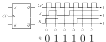

## 1번
반송파의 진폭과 위상을 동시에 변화시켜 전송하는 것은 QAM이므로 답은 **4번** 이다.

## 2번
1. PN접합 부근에서는 한 영역의 다수 캐리어가 반대편 영역으로 넘어가서 전자와 정공이 결합해서 사라지므로 결정을 이루며 움직일 수 없는 이온들만이 남게 되어 이 영역을 캐리어가 없는(공핍된)영역이란 뜻에서 공핍 영역이라고 한다.
2. PN접합 부근에서 움직일 수 없는 이온들과 전하 평형을 이루던 캐리어들이 사라짐에 따라 남은 이온들이 전계를 만들어내고, 이로부터 전위차가 생기는데 각 영역의 다수 캐리어가 상대방으로 넘어가기 위해서는 이 전위차를 거슬러 올라가야 한다.
   이렇게 장벽 역할을 하는 이 전위차를 전위장벽이라고 한다.
3. PN접합 부근의 N영역에서는 전자들이 사라짐에 따라 +이온들이, P영역에서는 정공들이 사라짐에 따라 -이온들이 남는다.
4. PN접합이 형성되는 순간 접합 부근의 N영역에 있던 자유 전자들이 접합을 넘어 P영역 쪽으로 확산해간다. P영역에는 전자들이 적으니까.
   그러다가 위에서 말한 전위장벽이 생기게 되면 이 전위장벽에 가로막혀 확산하는 전자의 양과 전위차에 의해 미끄러져 돌아오는 전자의 양이 같아지는 평형을 이루게 된다.

따라서 답은 **3번** 이다.

## 3번
N-MOSFET이 포화 영역에 있을 때 드레인 전류 식은 다음과 같다.
$$
I_D=\frac{1}{2}\mu_nC_{ox}\frac{W}{L}(V_{GS}-V_{tn})^2
$$
주어진 상황에서 $V_{DS}=5>V_{GS}-V{tn}=2-1=1$이므로 각 N-MOS들은 포화 영역에 있으니 위 식을 적용할 수 있다. 또한 $V_{GS}-V{tn},\mu_n,C_{ox}$들은 모두 같으므로 전류의 비율은 $\frac{W}{L}$의 비율과 같다. 따라서
$$
I_{D1}:I_{D2}:I_{D3}=\frac{2}{1}:\frac{8}{2}:\frac{16}{4}=1:2:2
$$
이므로 답은 **2번** 이다.

## 4번
(가),(나) 모두 한 비트 구간 내에서 $0$으로 돌아가는 구간이 없다. 따라서 둘 다 RZ는 일단 아니다. 그럼 남는 건 **4번** 이겠다.
각 라인 코드들이 어떤 것들인지는 각자 찾아보자.

## 5번
먼저 $V_{in}=20 \text{ V}$일 경우 다이오드의 음극 쪽이 더 높은 전압을 가질 것이다. 낮은 값을 가지면 다이오드를 통과한 전류는 $2 \text{V}$에서 $V_{in}=20 \text{V}$로 거슬러 흐르는 이상한 상황이 나타날 테니까.
그러므로 이 때엔 다이오드가 꺼지고, $R$을 통과하는 전류가 갈 곳이 없으니($V_{out}$은 개방된 것이다) 전류도 흐르지 않고, 결국 $R$에 의한 전압 강하는 없다. 그러므로
$$
V_{out, V_{in}=20}=V_{in}-0=V_{in}=20 \text{ V}
$$
이다.
다음으로 $V_{in}=-20 \text{V}$일 때를 살펴보자. 이는 $2 \text{ V}$보다 훨씬 낮은 값이므로 다이오드의 음극이 더 낮은 전압을 가질 것이라고 추측할 수 있다. 이때 다이오드는 켜지므로 $2 \text{V}$가 그대로 출력으로 나타나니까
$$
V_{out,V_{in=-20}}=2 \text{V}
$$
이다. 이 때 전류는 $2 \text{V}$에서 $V_{in}=-20 \text{ V}$로 흐르므로 추측이 맞음을 검증할 수 있다. 따라서 답은 **3번** 이다.

## 6번
$\overline{A\cdot 1}=\overline{A}$, $\overline{B+1}=\overline{1}=0$, $C\cdot 1=C$이다. 이들과 연결된 게이트는 NOR 게이트이므로 그 출력은 $\overline{\overline{A}+0+C}=A\cdot 1\cdot \overline{C}=A\overline{C}$이다.
마지막 게이트는 NAND 게이트이므로 그 출력은
$$
F=\overline{(A\overline{C})\cdot C}=\overline{A\cdot 0}=\overline{0}=1
$$
이니 답은 **2번** 이다.

## 7번
1. 공통모드 입력이라면 두 입력에 똑같은 신호가 들어가야 하는데 한쪽은 AC, 다른 쪽은 $0$이 들어가므로 공통모드가 아니다. 차동증폭기는 맞다.
2. 이미터 신호는 이미터 팔로워 신호라고 볼 수 있으므로 $V_{in}$과 동위상 맞다.
3. 출력신호 $V_{out1}$은 공통 이미터 증폭기의 출력이므로 $V_{in}$과 반대 위상이다. $V_{in}$이 커지면 전류가 더 많이 흐르고, 그 뜻은 $R_{C1}$에서 전압강하가 더 많이 일어난다는 뜻이니 컬렉터 전압이 낮아지는 정도가 더 커질 것이다.
4. 출력신호 $V_{out2}$는 입력신호 $V_{in}$과 동위상이다. $Q_1$의 AC 컬렉터 전류는 $Q_2$의 이미터로 들어가서 칼렉터로 나간다. 따라서 $V_{in}$이 커져서 $Q_1$의 AC 컬렉터 전류가 커지면 이는 $Q_2$의 컬렉터에서 $V_{CC}$로 가는 AC 컬렉터 전류가 커지는 것을 의미하고, 이는 $Q_2$의 컬렉터 전압이 올라간다는 뜻이다.

따라서 답은 **2번** 이다.

## 8번
1. $V_{B}=5.7-0.7=5 \text{ V}$이다.
2. 베이스 전류는 $I_B=\frac{5}{500}=0.01 \text{ mA}$이므로 컬렉터 전류는
   $$
   I_C=\beta_{DC} I_B=100\times 0.01=1 \text{ mA}
   $$
   이다.
3. 
  $$
  V_C=4=I_CR_C=1\times R_C \Rightarrow R_C=4 \text{ k}\Omega
  $$
  이다.
4. PNP BJT의 활성영역에서는 N타입인 베이스 전압이 P타입인 컬렉터 전압보다 높다. 즉 역방향 전압이 걸려있다.

따라서 답은 **3번** 이다.

## 9번
주어진 $R, L, C$ 병렬 연결 임피던스에 전류를 흘렸을 때 걸리는 전압의 비율이 $H(\omega)$이므로 결국 병렬 임피던스를 묻는 것이다.
그냥 직접 계산을 해 보자.
$$
\begin{equation}
   \begin{split}
      H(\omega)&=R||j\omega L||\frac{1}{j\omega C}\\
      &=\frac{1}{\frac{1}{R}+\frac{1}{j\omega L}+j\omega C}\\
      &=\frac{R}{1+\frac{R}{j\omega L}+jR\omega C}\\
      &=\frac{R}{1+jR\left(\omega C - \frac{1}{\omega L} \right)}\\
      &=\frac{R}{1+jR\sqrt{\frac{C}{L}}\left(\omega \sqrt{LC}-\frac{1}{\omega \sqrt{LC}}\right)}
   \end{split}
\end{equation}
$$
이므로 답은 **3번** 이다.
그런데, 이걸 직접 이렇게까지 해야 하는가? 단위를 이용해서 풀어보자. 먼저 $H(\omega)$는 저항의 단위($\Omega$)를 가질 것이다. 주어진 보기들을 관찰해 보면 분자에 다 $R$이 있으므로, 분모는 무차원 숫자여야 할 것이다.
제일 앞의 $1$은 좋다. 무차원 숫자 맞다. 다음으로 괄호 안을 보자. 덧셈과 뺄셈은 같은 단위를 갖는 물리량들에서만 적용이 가능하다. 그런데, 아마 다음과 같은 식을 본 적이 있을 것이다(공진주파수다).
$$
\omega=\frac{1}{\sqrt{LC}}
$$
따라서 $\frac{\omega}{\sqrt{LC}}$는 결국 $\omega^2$의 차원, 즉 $\frac{1}{\text{시간}^2}$의 단위를 갖고, $\frac{\sqrt{LC}}{\omega}$는 이의 역수이니 $\text{시간}^2$의 단위를 가질 것이다.
그러므로 보기 1,2는 틀린 식이다.

한편 $\omega\sqrt{LC}$나 이의 역수는 무차원 숫자이므로, 남은 것은 $R\sqrt{\frac{C}{L}}$이나 $R\sqrt{\frac{L}{C}}$가 무차원 상수냐 아니냐는 것이다.
여기서 인덕터는 저항과 비슷한 성질($V=j\omega L I$), 그리고 커패시터는 저항의 역수와 비슷한 성질($I=j\omega C V$)을 가짐을 떠올려보자.
따라서 $\sqrt{\frac{C}{L}}$은 $\sqrt{\left(\frac{1}{\text{저항}^2}\right)}=\frac{1}{\text{저항}}$의 단위를 가지므로 $R\sqrt{\frac{C}{L}}$은 무차원 숫자이다. 이에 해당하는 보기는 3번이므로 위에서 푼 것과 같은 결과를 줌을 알 수 있다.

## 10번
먼저 $I_S$와 $R_S$를 소스 변환으로 전압원과 직렬 저항으로 바꿔보자. 그러면 입력 전압원은
$$
V_S=R_S I_S
$$
이고, OPAMP의 -단자로 연결되는 저항은
$$
R_S+R_1
$$
이 될 것이다.

이로부터 입력 전압 대비 출력 전압(=증폭률)을 구하면
$$
\begin{equation}
   \begin{split}
      \frac{V_{out}}{V_S}&=-\frac{R_f}{R_S+R+1}\\
      &=-\frac{30}{2+4}\\
      &=-5
   \end{split}
\end{equation}
$$
이고, $V_S=R_S I_S$임에 따라
$$
\begin{equation}
   \begin{split}
      \frac{V_{out}}{I_S}&=\frac{V_{out}}{V_S}\times R_S\\
      &=-5 \times 2\times 10^3\\
      &=-10000
   \end{split}
\end{equation}
$$
이므로 답은 **4번** 이다.

## 11번
1. 주파수가 높아지면 커패시터의 임피던스는 $\frac{1}{j\omega C}$임에 따라 작아진다. 따라서 커패시터에 걸리는 출력 전압은 낮아지므로 고역이 약해지는 저역통과 필터로 사용될 수 있다.
2. 전압이득은
   $$
   \begin{equation}
      \begin{split}
         H(\omega)&=\frac{\frac{1}{j\omega C}}{R+\frac{1}{j\omega C}}\\
         &=\frac{1}{j\omega CR+1}
      \end{split}
   \end{equation}
   $$
   이므로 옳지 않다. 보기의 식은 주파수가 낮을 때 $0$에 가까워지므로 저역통과 필터에 대한 식이 될 수 없다.
3. 교류 입력전압과 출력전압의 위상차는 위에서 구한 $H(\omega)$의 위상을 보면 된다. 즉
   $$
   \begin{equation}
      \begin{split}
         \angle H(\omega)&=\angle\left(\frac{1}{j\omega CR+1}\right)\\
         &=-\angle(j\omega CR+1)\\
         &=-tan^{-1}(\omega CR)
      \end{split}
   \end{equation}
   $$
   이므로 옳지 않다.
4. 입력에 직류 전압 신호만 인가하면 커패시터는 개방되고 저항을 흐르는 전류는 없게 된다. 따라서 전압강하 없이 그대로 입력전압이 나타나므로 전압이득은 $1$이 된다.

따라서 답은 **1번** 이다.

## 12번
반가산기에서 합과 캐리는 다음과 같다.
$$
\begin{gather}
   S=X\oplus Y\\
   C=X\cdot Y
\end{gather}
$$
따라서 답은 **2번** 이다.

## 13번
제너전압 $8 \text{V}$가 걸려있다고 하자. 그러면 $40\Omega$ 양단의 전압차는 $10 \text{V}$이므로 전류는
$$
\frac{10}{40}=0.25=250\text{ mA}
$$
이다. 이 전류 중 $80 \text{ mA}$가 전류원으로 흐르니 제너다이오드를 흐르는 전류는
$$
I_Z=250-80 \text{ mA}
$$
이므로 답은 **3번** 이다.

## 14번
JK 플립플롭의 규칙은 다음과 같다.
$$
\begin{gather}
   J=0, K=0 \Rightarrow Q_+=Q\\
   J=1, K=0 \Rightarrow Q_+=1\\
   J=0, K=1 \Rightarrow Q_+=0\\
   J=1, K=1 \Rightarrow Q_+=\overline{Q}
\end{gather}
$$
SR 플립플롭의 문자를 J,K로 각각 바꾸고, 다만 SR 플립플롭에선 정의되지 않던 $J=K=1$일 때 반전시키는 것만 기억하면 된다.
이 규칙에 따라 출력 $Q$를 구하면 아래 그림과 같다.

이에 해당하는 보기는 **4번** 이다.

## 15번
1. $L(j\omega_0)=-1$이어야 출력이 증폭되거나 다른 변화 없이 그대로 유지된다.
2. 기본증폭기의 입력신호가 $A$배 증폭되고 나면 귀환신호는 $A\beta=L(j\omega_0)=-1$배 되어서 돌아와서 입력되므로 기본증폭기의 입력신호와 귀환신호의 크기는 같다.
3. 귀환신호가 입력신호에서 뺄셈되므로 입력신호는 $-L(j\omega_0)=1$이 된다. 따라서 입력신호와 귀환신호는 위상이 같다.
4. 그렇다.

따라서 답은 **1번** 이다.

## 16번
먼저 PMOS 쪽을 보자. $A$와 $B$ 모두 $0$이어야 출력은 $1$이 된다. 즉 $\overline{A} \cdot \overline{B}$이다. 이렇게 $1$이 되거나 또는, $C$와 $D$를 보면 이중 하나라도 $0$이라면 출력은 $1$이 된다. 따라서
$$
Y=\overline{A} \cdot \overline{B}+\overline{C}+\overline{D}
$$
이므로 답은 **4번** 이다.

## 17번
2차측의 임피던스가 1차측에는 어떻게 보일까? 1차측 회로만 잘라서 변압기 자리에 저항 $R_L$을 달고 여기에 $V_0$라는 전압을 걸었을 때 흐르는 전류는 $\frac{V_0}{R_L}$이다.
주어진 회로에서 $V_0$를 가하면 2차측에는 $nV_0$라는 전압이 발생한다. 이에 따라 2차측에 흐르는 전류는
$$
\frac{nV_0}{R_L}
$$
이다. 에너지 보존 법칙에 의해 1차측에 흐르는 전류 $I_0$는 다음 식을 만족한다.
$$
\begin{equation}
   \begin{split}
      &V_0 I_0=nV_0 \frac{nV_0}{R_L}\\
      & \Rightarrow I_0=n^2\frac{V_0}{R_L}
   \end{split}
\end{equation}
$$
즉, 그냥 1차측에 $R_L$을 달았을 때에 비해 전류가 $n^2$배로 흐르는 것이다. 따라서 1차측에서 바라봤을 때 $R_L$의 등가저항은
$$
\begin{equation}
   \begin{split}
      &R_e=\frac{V_0}{I_0}=\frac{1}{n^2}R_L\\
      &\Rightarrow R_L=n^2\times R_e=0.04 R_e
   \end{split}
\end{equation}
$$
이다. 한편 최대 전력 전달을 위해서는 증폭기 내부 저항 $R_S$와 등가 부하 $R_e$가 같아야 하므로
$$
R_L=0.04\times R_S=8 \text{ }\Omega
$$
가 되니 답은 **1번** 이다.

## 18번
전달 컨덕턴스는
$$
\begin{equation}
   \begin{split}
      g_m&=\frac{\partial I_D}{\partial V_{GS}}\\
      &=k_n(V_{GS}-V_{tn})
   \end{split}
\end{equation}
$$
이므로 답은 **3번** 이다. 전달컨덕턴스는 $V_{GS}$가 작게 변할 때 $I_D$가 얼마나 변하냐는 비율을 나타내고, 따라서 여기에 드레인 쪽 저항 $R_D$가 곱해지면 $V_{GS}$가 변할 때 출력 전압은 $g_mR_DV_{GS}$만큼 변함을 알 수 있다. 그래서 전압이득이 $g_mR_D$ 형태로 나타난다.

## 19번
1. 위에서 보듯 $R_D$와 비슷한 역할을 하는 $R_C$가 증가하면 중간주파수 대역의 전압이득은 증가한다(증가 감소를 따질 때 부호 $-$는 생각하지 말고 크기만 고려한다).
2. 바이패스 커패시터는 $R_E$와 병렬로 달려서 주파수가 높아지면 작은 임피던스를 갖게 되어 $R_E$로 인한 전압이득 감소를 줄이는 효과를 낸다.
3. 그렇다. $V_{in}$이 커지면 더 많은 전류가 흐르고, 이는 $V_{out}$의 크기가 더 작아져야 함을 의미한다. 따라서 반대 위상이다.
4. 결합 커패시터는 저주파 대역의 특성을 결정한다.

따라서 답은 **4번** 이다.

## 20번
먼저 왼쪽의 $20 \text{ V}$ 전압원과 $20 \Omega$ 저항을 소스 변환해보자.

다음으로 병렬로 연결되어 있는 것들은 자리를 바꿀 수 있으니(왜일까?) 아래와 같이 자리를 바꾸자.

전류원들은 하나로 묶일 때 더해지고(왜일까?) 병렬 저항들도 하나로 만들 수 있으므로 다음과 같이 정리하자.

마지막으로 소스 변환을 한번 더 하자.

위 그림에서 최대 전력 전달 조건에서는 $R_L=15 \Omega$여야 함을 알 수 있다. 이때 전압는 두 $15 \Omega$로 동일하게 나눠져 가해지니 하나의 저항에는 $9 \text{ V}$가 걸린다.
따라서 $R_L$에 전달되는 최대 전력은
$$
P_L=\frac{81}{15}=\frac{27}{5}=\frac{54}{10}=5.4 \text{ W}
$$
임을 알 수 있다. 따라서 답은 **1번** 이다.